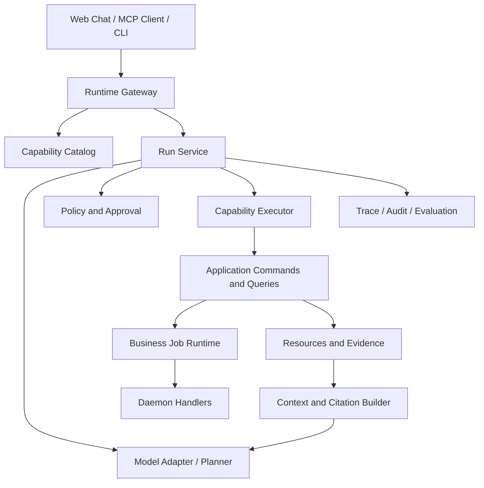

# Agent 友好型 LLM 原生运行时路线图

> 状态：后续规划，不属于 1.0 已实现能力
>
> 基线版本：1.0.0
>
> 更新日期：2026-07-12

## 1. 文档定位

本文定义 Yamibo 在 1.0 之后向 Agent 友好型、LLM 原生运行时演进的目标架构、稳定接口和实施门禁。它是未来运行时设计的规划真相源，不替代以下当前事实文档：

- [agent-interface.md](agent-interface.md)：1.0 已公开的 tool、resource、错误和 Job 行为
- [architecture-for-agents.md](architecture-for-agents.md)：当前代码分层和修改路径
- [chat-design.md](chat-design.md)：当前 Web Chat 的边界
- [release-readiness.md](release-readiness.md)：1.0 发布门禁

这里所说的“LLM 原生”不是把 prompt、模型调用或向量检索散落进各业务模块，而是让系统具备机器可发现的能力、显式副作用、可暂停和恢复的执行、可验证证据、策略约束与完整运行轨迹。模型可以替换，业务契约和审计事实必须稳定。

## 2. 1.0 基线与缺口

### 2.1 已有基础

| 能力 | 1.0 状态 | 可复用基础 |
|---|---|---|
| 结构化工具结果 | 已实现 | `AgentResult`、`AgentError`、`AgentAction` |
| Tool 与 Resource 分离 | 已实现 | FastMCP tools、`yamibo://` resources |
| 长任务异步化 | 已实现 | PostgreSQL jobs、lease、daemon、events |
| 错误提示与建议动作 | 部分实现 | error code、`agent_hint`、`next_actions` |
| 大内容分页和资源化 | 已实现 | cursor/chunk、thread resources |
| Agent 操作指南 | 已实现 | `AGENTS.md`、`.yamibo/chat`、MCP guides |
| 外部模型对话入口 | 已实现 | OpenAI-compatible/Hermes HTTP、SSE |
| 内建 tool loop | 未实现 | 当前 Chat 不传 tool schema、不执行工具 |
| Capability manifest | 未实现 | 只有工具注册信息和 schema resource |
| 策略、审批与权限 | 未实现 | 主要依赖 loopback 和工具自身校验 |
| Run/step 持久化 | 未实现 | 只有业务 Job，不记录完整 Agent run |
| 引用与证据闭环 | 部分实现 | resource URI 存在，但无统一 citation contract |
| Agent 回归评测 | 部分实现 | 接口测试存在，缺 transcript/evaluator 门禁 |

### 2.2 核心缺口

1. 模型无法通过单一机器接口获知工具的副作用、幂等性、成本、前置条件和终态读取方式。
2. 对话会话、Agent run、业务 Job 三种状态尚未分离，无法可靠暂停、审批、恢复和重放。
3. 外部模型输出与实际工具执行没有统一 step 记录，界面无法证明“模型建议了什么、系统执行了什么”。
4. Resource URI 能定位内容，但缺少统一的 citation、snapshot/version 和 evidence bundle 契约。
5. 权限边界集中在网络部署层，尚无面向每个 capability 的 policy decision 和审计链。
6. 数据挖掘能力可以被调用，但研究问题、数据切片、算法版本、证据和报告之间还不能形成可复现 lineage。

## 3. 设计原则

1. **契约优先**：先稳定 capability、run、step、evidence 契约，再增加 planner。
2. **业务逻辑单一来源**：运行时只能调用 application 层公开能力，不得直接写 repository、抓网页或操作归档文件。
3. **副作用显式**：每个能力必须声明 `read_only`、`enqueue_job`、`mutating` 或 `destructive`。
4. **异步优先**：超过短请求预算的行为必须创建业务 Job，Agent run 只观察和编排，不占用模型连接等待。
5. **默认最小权限**：读取自动允许，远端访问受预算约束，写入需策略判定，破坏性维护默认不进入 Agent 能力面。
6. **证据先于结论**：研究和问答输出必须能回指稳定 resource、数据库快照或 artifact。
7. **可恢复而非假装可靠**：run、step 和 Job 都应具有明确状态、超时、重试和人工接管点。
8. **模型中立**：OpenAI-compatible、Hermes 或其他模型只由 adapter 接入，核心运行时不依赖某个模型的私有消息格式。
9. **预算可计算**：token、tool call、远端请求、运行时间和并发都要有硬上限。
10. **评测驱动发布**：没有 transcript 回归、策略测试和故障恢复测试的 tool-loop 不能进入默认开启状态。

## 4. 目标分层



### 4.1 Runtime Gateway

负责认证主体、租户或工作空间、请求 id、流式协议和 API 版本。它不做规划，也不包含业务规则。Web、MCP 和未来 API 应共享同一 run service，而不是各自实现工具循环。

### 4.2 Capability Catalog

将现有 `PUBLIC_AGENT_TOOLS` 和 resource schema 扩展为机器可读 manifest。建议每项至少包含：

```json
{
  "name": "create_thread_archive_job",
  "version": "1",
  "description": "Create an asynchronous archive job.",
  "input_schema": {},
  "output_schema": {},
  "effect": "enqueue_job",
  "idempotency": "deduplicated_by_active_job",
  "risk": "write",
  "requires": ["remote_access", "daemon"],
  "produces": ["job_status_resource"],
  "followups": ["read_job", "wait_for_job"],
  "timeout_class": "short",
  "cost_hints": {"remote_requests": 0}
}
```

Manifest 应由代码注册信息生成，文档从 manifest 派生或校验，禁止手工维护第三份工具清单。

### 4.3 Run Service

Agent run 是一次用户意图的可恢复执行实例，与聊天会话和业务 Job 分开：

- conversation：用户可见的消息历史
- run：一次目标、预算、策略和最终结论
- step：一次模型决策、工具调用、审批或证据读取
- job：归档、导出、索引等后台业务执行

建议 run 状态：`created -> planning -> awaiting_approval -> executing -> waiting_job -> synthesizing -> succeeded`，任一活动状态都可以进入 `failed`、`cancelled` 或 `expired`。每个状态转换必须写事件并可幂等重放。

### 4.4 Model Adapter / Planner

模型适配层只负责消息格式、结构化工具调用和 token 统计。Planner 输入必须是经过裁剪的 capability、上下文和预算，不允许把数据库连接、文件路径或维护命令直接暴露给模型。

首版只支持单 Agent、串行步骤和确定性上限：

- 最大步骤数
- 最大模型调用次数
- 最大工具调用次数
- 最大远端请求预算
- 最大 wall-clock 时间
- 最大上下文和输出 token

达到上限时返回结构化 `budget_exhausted`，不得静默继续或递归创建新 run。

### 4.5 Policy 与 Approval

策略输入至少包括主体、capability、参数摘要、effect、risk、资源范围和当前预算。输出固定为 `allow`、`deny` 或 `require_approval`，并记录规则版本和原因。

建议默认策略：

| 风险级别 | 示例 | 默认行为 |
|---|---|---|
| read | 本地归档读取、Job 状态 | 自动允许 |
| remote_read | 论坛搜索、远端预览 | 允许但受频率和账号预算限制 |
| write | 创建归档、更新、RAG Job | 可配置为自动允许或单次审批 |
| sensitive_write | 配置修改、批量任务 | 必须审批并展示参数摘要 |
| destructive | reset、清理、删除数据 | 不进入公共 Agent catalog |

### 4.6 Capability Executor

Executor 将批准后的调用映射到 application command/query，统一处理：

- schema 校验和参数规范化
- idempotency key 和重复调用抑制
- `AgentResult` wire contract
- Job id 与 resource URI 提取
- 超时、取消和错误分类
- step 输入输出脱敏

它不能通过 CLI 子进程绕回系统，也不能直接调用 daemon handler。

### 4.7 Context、Evidence 与 Citation

上下文构建器负责按用户问题选择最小必要内容，优先顺序为结构化摘要、证据片段、分页正文，禁止默认灌入整帖或全量历史。

统一 citation 建议包含：

```json
{
  "citation_id": "cite_01",
  "resource_uri": "yamibo://threads/572313/posts",
  "snapshot_id": "archive-version-or-index-version",
  "locator": {"pid": 123456, "floor": 8},
  "excerpt_hash": "sha256:...",
  "retrieved_at": "2026-07-12T00:00:00Z"
}
```

回答只引用实际读取过的 evidence；模型生成文本不能反向伪造 citation。大文本继续使用 resource 和 cursor，不复制到 run event。

### 4.8 Trace、Audit 与 Evaluation

每个 run 应形成 append-only 事件流：模型请求摘要、模型响应摘要、policy decision、tool call、Job 关联、resource 读取、审批和终态。秘密、cookie、完整 prompt 和大正文必须按字段脱敏或仅存 hash/reference。

运行轨迹既用于排障，也用于离线评测。评测至少覆盖：

- 是否选择正确能力
- 是否误把建 Job 当作完成
- 是否遵守审批和远端请求预算
- 是否在失败后读取正确诊断面
- 结论是否由真实 citation 支撑
- 相同 fixture 下是否可稳定重放

## 5. 数据模型与接口建议

### 5.1 新增持久化实体

建议独立于 `jobs` 增加：

- `agent_runs`：目标、主体、策略版本、预算、状态、最终输出
- `agent_steps`：顺序、类型、状态、capability、输入输出摘要、错误
- `agent_run_events`：append-only 状态变化与审计事件
- `agent_approvals`：请求、决定、决定者、过期时间
- `agent_citations`：run/step 到 resource snapshot 的引用
- `agent_artifacts`：报告、导出和评测结果的稳定定位

不要把这些字段塞进现有 chat `sessions.json` 或 `jobs.payload`。开发初期可以单机实现，但 schema 从一开始应支持 PostgreSQL 和清晰外键。

### 5.2 API 草案

建议先形成内部 application API，再映射到 Web/MCP：

- `create_agent_run(goal, context_refs, budget, policy_profile)`
- `read_agent_run(run_id)`
- `stream_agent_run_events(run_id, cursor)`
- `approve_agent_step(run_id, step_id, decision)`
- `cancel_agent_run(run_id)`
- `list_capabilities(profile=None)`
- `read_agent_artifact(artifact_id)`

所有写接口要求 idempotency key；所有列表和事件接口要求 cursor；所有响应延续 `AgentResult` 错误语义。SSE 只是事件传输方式，数据库事件序号才是恢复依据。

## 6. 受控 Tool Loop

推荐循环是显式状态机，而不是在 HTTP handler 内写无限 `while`：

1. 建立 run 并冻结 capability/policy 版本。
2. 构建最小上下文，调用模型产生结构化下一步。
3. 校验工具名、参数、预算和策略。
4. 必要时进入 `awaiting_approval`，不占用模型连接。
5. Executor 调用 application 层，记录 step。
6. 若产生 Job，run 进入 `waiting_job`，由事件或调度器恢复。
7. 读取必要 resource/evidence，继续下一步或生成结论。
8. 终态写入 artifact、citation 和预算统计。

任何异常都必须落到可观察状态。模型格式错误允许有限次数修复；业务错误遵循 `retryable` 和 `suggested_actions`；系统错误不应由模型无限重试。

## 7. 与数据挖掘的协同

LLM 不应直接承担聚合统计和趋势计算。数据挖掘路径继续由确定性管线生成 mart、assignment、evidence 和 report artifact，LLM 负责：

- 将研究问题映射到受支持的 intent 和切片参数
- 选择已有 trend/evidence capability
- 对结构化结果做解释和对比
- 从已读取 evidence 中生成带 citation 的叙述
- 暴露数据覆盖率、版本和不确定性，而不是补造结论

为了可复现研究，应为每次研究 run 固化：

- 数据集范围、论坛、时间窗和过滤条件
- archive/index/schema/parser/model 版本
- SQL/算法或 materializer 版本
- evidence 抽样策略与随机种子
- 输入 resource snapshot 和输出 artifact hash

2.0 的 append-only 采集快照和回复关系图可接入同一 evidence contract，不需要重新设计 Agent 接口。

## 8. 安全与部署边界

1. Runtime Gateway 在远程部署时必须位于 TLS、认证和速率限制之后。
2. Web 用户、MCP 客户端和后台 worker 使用不同凭据与数据库角色。
3. 模型供应商只接收经过裁剪的上下文，不发送 cookie、账号、内部路径或无关私人数据。
4. prompt injection 视为不可信内容：论坛正文永远不能改变 system policy、capability 或审批规则。
5. tool 输出进入下一轮模型前进行类型校验、长度限制和不可信内容标记。
6. 审批 token 必须绑定 run、step、参数 hash 和过期时间，不能复用。
7. 多实例部署依赖 PostgreSQL 事件和 lease；本地 JSON 文件不能作为分布式运行时状态源。

## 9. 分阶段实施

### Phase A：契约加固，建议 1.1

交付：

- capability manifest 与 `yamibo://schema/capabilities`
- tool 描述、文档和 manifest 一致性测试
- effect/risk/idempotency/followup 元数据
- citation 与 artifact 基础数据结构
- Agent transcript fixture 和离线 evaluator

验收：不启用自主 tool loop，现有 MCP/CLI 行为零回归；Agent 可以仅靠 manifest 判断副作用和下一步。

### Phase B：可观察的单步执行，建议 1.2

交付：

- `agent_runs`、`agent_steps`、事件流和预算
- policy engine 与 approval API
- 单步 capability executor
- Web 展示 run/step/approval/citation

验收：每个执行动作可审计、可取消、可幂等重放；破坏性能力不可达。

### Phase C：受控多步运行时，建议 1.x

交付：

- model adapter 和有限状态 tool loop
- Job 等待/恢复，不占用请求连接
- evidence builder 与带引用回答
- 故障注入、恢复和 transcript 回归门禁

验收：固定场景下完成搜索、探测、建 Job、等待、读取和引用闭环；预算耗尽、审批拒绝、daemon 中断均有确定终态。

### Phase D：研究与规模化，建议 2.0

交付：

- 可复现 research run 与 dataset lineage
- 对象存储和无状态 worker
- 多租户权限和配额
- 在明确需求下再评估多 Agent、模型路由和并行执行

验收：跨实例恢复、租户隔离、研究 artifact 可复算；多 Agent 不得先于单 Agent 状态机稳定。

## 10. 建议代码边界

规划落地时优先新增清晰模块，不扩大现有 router：

| 目标模块 | 职责 |
|---|---|
| `application/agent_runtime_commands.py` | 创建、审批、取消 run |
| `application/agent_runtime_queries.py` | run、step、event、artifact 查询 |
| `agent_runtime/catalog.py` | capability manifest |
| `agent_runtime/policy.py` | 纯策略判定 |
| `agent_runtime/executor.py` | application capability 调用适配 |
| `agent_runtime/orchestrator.py` | 有限状态推进，不放业务实现 |
| `agent_runtime/model_adapter.py` | 模型协议与结构化输出 |
| `agent_runtime/context.py` | resource 选择、裁剪和 citation |
| `db/repositories/agent_runs.py` | 运行时持久化 |
| `web_fastapi/routers/agent_runs.py` | 薄 HTTP/SSE 接口 |

这些模块依赖现有 application contract、repository 和 Job runtime；daemon handler 不依赖 Agent runtime，避免形成循环依赖。

## 11. 明确不做

- 不在 1.0 临时加入隐藏 tool loop。
- 不允许模型执行任意 CLI、SQL、Python 或文件系统命令。
- 不用 prompt 文本代替 policy、schema 或状态机。
- 不为“看起来智能”而自动批准批量写入和维护操作。
- 不在缺少真实需求时先实现多 Agent 协商、长期记忆或复杂模型路由。
- 不把聊天记录当作业务事实、审计日志或数据集 lineage。

## 12. 决策门禁

进入每一阶段前应形成 ADR，至少确认：

1. capability manifest 的版本和兼容策略；
2. run 与 Job 的关联、取消和恢复语义；
3. policy/approval 的主体模型；
4. prompt、tool output 和事件的保留及脱敏策略；
5. citation snapshot 的稳定标识；
6. 模型预算和远端请求预算的默认值；
7. transcript evaluator 的通过阈值和发布阻断规则。

只有上述契约稳定后，才应把内建 LLM runtime 作为默认产品能力开放。
