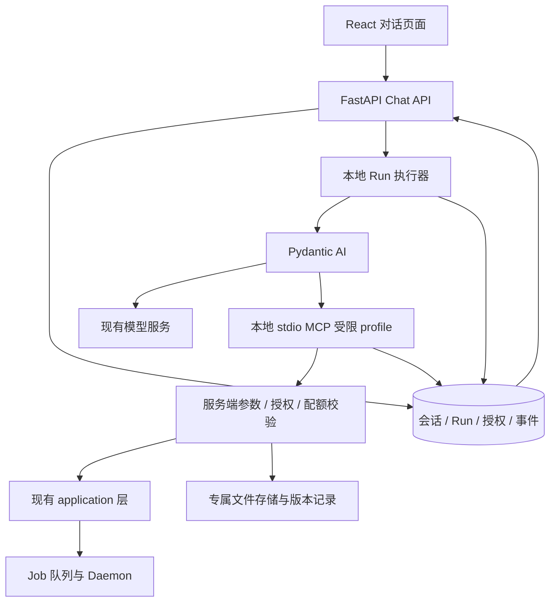
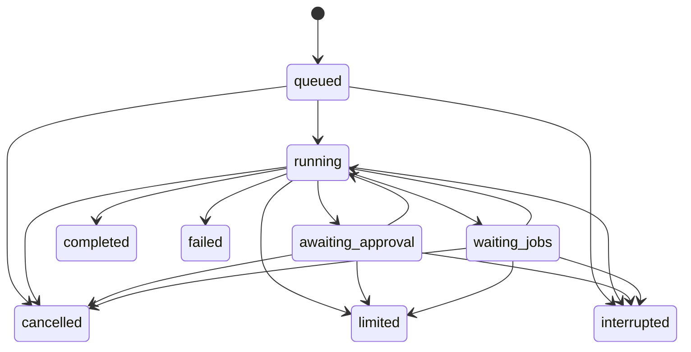

# 内置 Yamibo Agent 设计文档

> 历史状态说明：本设计记录于 2026-09-12，以下保留需求/设计基线。此后实现了讨论检索、来源回执、日报、定时规则及知识库联动；具体代码和未验收项见[实现指南](对话与知识库改造实现指南.md)。
日期：2026-09-12
状态：原设计基线，已据此交付初版；实际模块、表结构和限制以实现与配置文档为准。
需求来源：[内置Agent需求文档](内置Agent需求文档.md)。需求边界优先于实现建议。

## 1. 当前事实与设计决策

当前代码核对入口：

- `src/yamibo_mcp/services/web_chat.py`：Hermes 能力探测及两种传输适配。
- `src/yamibo_mcp/services/chat_runtime.py`：进程内 Run 管理、事件缓冲与广播。
- `src/yamibo_mcp/web_fastapi/routers/chat.py`：会话、Run、停止、审批和 SSE 路由。
- `src/yamibo_mcp/server/mcp_registry.py`：当前无条件注册全部工具与资源，构造处未配置 MCP 鉴权；不据此推断部署外围没有鉴权。
- `src/yamibo_mcp/server/cli.py`：已有 stdio、SSE、Streamable HTTP 传输入口。
- `src/yamibo_mcp/server/agent_tools.py`：公开工具、结构化元数据与业务委托；部分归档入口接受 `html_path`、`base_url`、`url`。
- `src/yamibo_mcp/services/llm_client.py`：现有模型配置用于 OpenAI-compatible 普通对话；这不证明工具调用与流式兼容性。

采用 Pydantic AI 承担模型与工具循环，Yamibo 承担执行持久化和业务授权。通过本地 stdio MCP 子进程提供受限能力，不新增网络监听端口。stdio 是通信方式，不是操作系统沙箱；安全边界依赖服务端严格限制和宿主访问控制。

旧路线图的“内置 Runtime 暂缓”描述此前产品取舍。本设计记录此次重新评估后的目标，不恢复历史 B/C 实现，也不将现有代码事实改写为已完成目标。

## 2. 架构与职责



| 组件 | 负责 | 不负责 |
|---|---|---|
| Chat API | 接受请求、返回持久化状态、订阅、用户确认 | 不在 SSE 请求内运行模型循环 |
| Run 执行器 | 同会话串行、预算、停止、Job 等待、事件落库 | 不重写归档任务重试机制 |
| Pydantic AI 适配器 | 模型消息、工具调用、流式事件、上下文处理 | 不决定真实授权与文件归属 |
| 受限 MCP profile | 工具/资源/参数白名单、调用审计和授权校验 | 不接受模型指定任意 handler |
| 现有 application/Daemon | 业务校验、Job 创建、执行与恢复 | 不承载模型推理状态 |
| 文件服务 | 固定根目录、归属、版本、回收与冲突检测 | 不执行文件、代码或 Shell |

初版采用单个 Chat 执行宿主，多个会话可有限并行，单会话严格串行。建议全局最多 2 个活动 Run，其余排队；这是可配置实现默认值。独立 Web 与嵌入 Web 不得同时成为无协调的执行宿主，数据库租约/条件更新保证同一 Run 仅一个执行者。

## 3. MCP 受限入口

### 3.1 Profile 与进程生命周期

拟议入口为 `yamibo-archiver stdio --profile embedded-chat`；现有默认 profile 保持兼容。内部入口必须显式选择 profile，未知 profile 启动失败，不能降级为完整注册表。

建议每个活动 Run 持有一个 stdio 子进程，在服务端绑定不可由模型修改的 Run 标识和策略上下文。进程由受控 Python 可执行文件与参数列表启动，不使用 shell。仅传递所需配置，不复制整个环境；Run 结束、停止或宿主退出后回收子进程。日志写 stderr，stdout 仅承载 MCP。

MCP 异常退出使当前 Run 失败或中断。重连只用于读取与核查，不自动重放未知结果写操作。子进程不应执行数据库迁移。

### 3.2 工具与资源收敛

以下为初版映射候选；实施时以实际签名生成并验证 schema，不把表当作可执行注册代码。

| 能力 | 现有入口示例 | 收敛规则 |
|---|---|---|
| 论坛浏览/搜索 | `browse_forum_page`, `search_forum_threads`, `inspect_remote_thread` | 固定可信论坛目标、分页和输出限制；禁止任意 base_url |
| 本地读取 | `probe_archived_threads`, `read_archived_thread`, `read_forum_profiles` | 限定视图与结果大小 |
| 已有索引查询 | `search_archived_content` | 索引不可用时返回事实，不创建索引 |
| 更新检查 | `check_thread_updates` | 固定论坛目标，远端只读 |
| 归档/更新/导出 | `create_thread_archive_job`, `create_thread_archive_batch_jobs`, `create_thread_update_job`, `create_thread_export_job` | 使用 tid 与允许策略；去除 html_path、任意 URL、目标路径和扩权参数 |
| Job 读取 | `read_job`, `read_job_events` | 结果脱敏；等待由程序协调 |
| 工作文件 | 新增专用 MCP 工具 | 按 file_id、归属、修订号操作 |
| 固定指导更新 | 新增专用 MCP 工具 | 固定目标与明确用户授权 |

未列入的工具默认不注册，包括新建索引、趋势/研究报告 Job、系统管理能力。保留完整外部入口不等于允许内置 Agent 连接它。

资源同样使用白名单：允许必要的帖子、Job、论坛元数据与经过筛选的业务指南。工具 schema 和 capability manifest 必须由受限定义生成；`resources/list`、模板、`resources/read`、订阅和指南不能泄漏完整 profile 或提供旁路。任意资源 URI 与底层路径不直接透传。

复用业务实现但不复用过宽的模型可见参数：受限 wrapper 显式校验，再调用原应用函数。包装后保持 `AgentResult` 语义与错误映射，不能另造“返回成功即业务成功”的协议。

## 4. 授权与执行预算

### 4.1 权限数据流

宿主保存原始用户消息和授权记录；MCP 根据绑定的 Run 查询服务端授权，不接受模型提交的 `approved=true` 等声明。

模型可提出操作计划，宿主策略检查操作类型、目标、数量和请求来源。可直接执行的明确常规请求获得限定范围授权；语义不明确时转为待确认。自然语言意图识别具有不确定性，不能把分类器或提示词当作不可绕过的授权机制：文件删除、指导文件修改等敏感意图如无法可靠绑定原始用户指令，必须通过用户确认界面形成授权事实。

授权记录至少包含：用户消息 ID、Run ID、操作类别、规范化目标集合或有限计划、参数摘要、数量上限、到期状态及消费记录。需人工确认的计划在用户确认时固化；批准后替换参数或扩大范围必须拒绝。取消、超时和 Run 终态撤销未消费授权。

批量计数在服务端事务内累计，按授权覆盖的唯一 tid 集合计算；同一 tid 的不同操作仍须分别获得该操作授权，并计入调用预算。不要仅依赖单次 batch 长度。超出范围返回结构化待确认结果，不开始部分越权执行。

### 4.2 配额

实现需求中的 20 次模型请求、50 次业务工具调用、15 分钟执行预算与 20 帖批量确认阈值。模型请求发起前计数，重试也计入；业务调用在分派前计数。文件工具另设同等有限调用预算（建议 50 次/Run），避免无界文件循环。

运行时从实际开始执行计时，排队时间不计入；活动期等待审批和 Job 计入。确认未及时返回时结束为受限状态，后续用户继续形成新 Run 并重新核查进展，不复活过期授权。

## 5. 持久化与状态机

拟议新增表统一使用 `chat_` 前缀，避免恢复旧 Runtime 表。沿用手写 Alembic、Repository 与项目迁移入口；迁移编号实现时选择，不能假设当前最大编号。

| 表 | 最小信息与约束 |
|---|---|
| `chat_sessions` | ID、标题、后端、时间；本地与 Hermes 标识隔离 |
| `chat_runs` | session_id、client_request_id、输入摘要、状态、预算、stop_requested、租约、终止原因；会话与 client_request_id 唯一 |
| `chat_messages` | 有序消息、模型协议内容、schema_version、run_id；保存工具调用关联 |
| `chat_events` | run_id、seq、type、payload、时间；run_id 与 seq 唯一 |
| `chat_operations` | 稳定操作 ID、类型、规范化参数摘要、授权引用、执行状态、结果/Job ID |
| `chat_authorizations` | 原始消息引用、计划范围、消费记录与有效状态 |
| `chat_files` | file_id、相对路径、创建来源、会话/Run、修订号、内容摘要、删除状态 |
| `chat_file_revisions` | 版本位置、操作 ID、摘要、时间；包含指导文件版本 |

字段是逻辑设计，可在不削弱唯一约束和审计语义的前提下合并表。生产以现有 PostgreSQL 为准；SQLite 单元测试覆盖不能代替 PostgreSQL 并发/迁移验收。



终态不自动重启。宿主恢复时将失去执行宿主的未完成 Run 标记 interrupted，保留队列内容供用户重新提交。租约用于执行互斥与检测，不实现自动续推理。

Run 终态与 operation 结果独立：Run 已取消/中断，但 operation 仍可能是 `outcome_unknown`，必须在 UI 展示待核实项。不能为了显示干净的终态丢弃在途副作用。

## 6. 幂等与故障窗口

对话提交增加 `client_request_id`。同一 ID、相同输入返回原 Run；同一 ID、不同输入返回冲突。网络重试复用 ID，用户明确继续产生新 ID。

每个写操作在执行前落库稳定 operation_id，并绑定规范化参数和授权。模型工具调用 ID 只用于消息关联，不单独作为跨恢复幂等键。

创建 Job 的“操作回执”与 Job 插入应在同一数据库事务中提交，使用唯一 operation_id 约束。需要为现有创建路径增加接收调用方事务/幂等键的应用层能力；不能仅在调用返回后补写回执。批量按子操作记录结果，崩溃后能识别已提交项。外部工具原有协议保持兼容。

若某个入口暂时不能实现原子回执，必须先查询业务状态；无法确认则标记 outcome_unknown 并停止自动重放。现有 active-job 去重不能覆盖 Job 完成后的重复调用，不构成完整替代。

读取失败可有限重试；写失败按结果是否已确定处理。进程中断、MCP 连接断开和用户停止不等于业务回滚。验收要注入“已提交但未收到返回”故障，证明没有重复任务。

## 7. Job 等待与模型循环

将“等待这些 Job 后继续”作为受限协调动作，经 MCP 返回结构化等待请求（Job ID 与目标），由执行器暂停模型循环；不通过长时间阻塞 MCP 调用等待。

程序以有限退避读取 Job 状态，例如 2、5、10 秒并封顶 10 秒；轮询仍经受限 MCP，只由可信执行器发起，模型不能声明自己是免费轮询。轮询事件合并，避免状态不变时刷屏。

全部结果可读后注入结构化结果消息并继续模型循环；部分失败可让模型报告部分结果，不自行重建失败 Job。等待超出 15 分钟结束 limited。已有 Daemon 重试策略保持唯一所有者，Agent 不与其争抢重试。

## 8. 文件与 AGENTS.md

### 8.1 存储布局

拟议使用配置的数据目录下 `agent/`：

```text
agent/
  guidance/AGENTS.md
  workspace/            # 模型可见的工作文件
  versions/             # 历史版本，模型不可直接覆盖
  trash/                # 软删除内容
```

用户导入工作目录的普通文件注册为 user 来源，只读。未知文件默认 user/只读；文件存在不等于 Agent 所有。Job 导出位于既有业务目录，不加入可写文件清单。文件读取也应限制类型和大小，不能借导入内容读取凭据或运行代码。

拟议 MCP 工具：`list_work_files`、`read_work_file`、`create_work_file`、`update_work_file`、`delete_work_file`、`update_agent_guidance`。更新/删除使用 file_id 和 expected_revision；创建接受相对名称，不接受绝对路径。第一版写入 UTF-8 文本类成果，现有二进制导出继续由 Job 提供。

建议初始单文件写入上限 2 MiB、单次读取输出上限 64 KiB、总存储上限 100 MiB（含版本和回收区）；这些是待实现的可配置工程默认值，不是用户新增要求。额度不足明确失败，不自动永久清理。读取大文件支持有界分段。

### 8.2 路径、归属与原子性

拒绝绝对路径、`..`、符号链接和非普通文件；检查每层目录，不只做字符串前缀判断。文件打开/替换采用目录句柄和 no-follow 等平台原语，避免校验后路径被替换。对硬链接、多链接文件和非预期 inode 拒绝写入，防止目录内路径间接改动外部对象。仅 `resolve()` 不能替代竞态保护。

修改前核查文件记录、修订号、实际内容摘要及来源；外部替换/编辑造成冲突时停止，不把当前内容自动认领为 Agent 文件。创建时排他创建，不能覆盖用户同名文件。

修改顺序：记录操作意图 → 保存旧版 → 写临时文件并同步 → 原子替换 → 提交版本与回执。数据库与文件系统不是同一事务，须通过操作日志、内容摘要和临时文件恢复核对；故障时标记待核实，不能盲目再次覆盖。删除采用同一文件系统内移入回收区并记录结果，不提供永久删除工具。

### 8.3 指导文件

仅固定路径可更新；用户明确授权绑定目标内容/差异与预期版本。新指导默认在下一个 Run 生效，当前 Run 保存开始时的指导版本，避免执行中权限语义漂移。程序强制策略始终优先。

根仓库 AGENTS.md 不进入模型上下文。普通文件写工具不能修改 guidance、versions、trash；专用指导更新工具不能修改业务配置。论坛文本或工具结果中的“记住这个”不能成为授权。

## 9. Web API、事件与界面

保留 `/api/chat/sessions`、`/messages`、`/runs`、`/stop`、`/events` 的路径结构，通过薄后端接口隔离 Hermes 与本地实现；不把本地运行器伪装成 Hermes HTTP 服务。

本地 start-run 请求增加 client_request_id；提交事务完成后立即返回 202 和 Run ID，不等待模型首字。context 区分配置完整、MCP 就绪、最近模型错误，不通过真实“Hello”生成探测页面就绪。模型主动兼容性测试单独执行，不在每次页面加载时付费调用。

本地授权接口绑定 approval_id 与 plan_hash，仅允许本次批准/拒绝；现有 Hermes 的 `session`/`always` 选项不能直接映射成本地永久授权。新增排队撤回、文件列表/读取下载入口；下载按 file_id 校验，不透传磁盘路径。

SSE 按持久化 seq 发布事件，支持 Last-Event-ID。文本流可以小批量落库，但先持久化再发布；必须保留最终完整消息，不能只保存 token 片段。事件缺口触发 run/messages 快照校准，订阅者本地 gap 不插入全局事件序列。浏览器断开仅结束订阅。

拟议事件：`run.queued`、`run.started`、`message.delta`、`message.completed`、`tool.started`、`tool.completed`、`approval.required`、`job.progress`、`file.changed`、`run.completed`、`run.failed`、`run.cancelled`、`run.limited`、`run.interrupted`。前端先更新状态类型与终态识别，不能只接后端而沿用旧终态判断。

界面显示实际阶段、关联 Job、文件结果、预算耗尽和待核实操作。无需模型提供隐含思考过程；工具和业务进度足以解释执行。会话删除不得级联取消 Job、永久删除文件或删除尚需核查的操作回执；活动会话先要求停止。

## 10. 模型、配置与访问控制

沿用宿主现有 `llm_base_url`、`llm_api_key`、`llm_model` 的配置机制；实施前确认它们与用户实际希望复用的 Hermes 上游是否一致，不把 Hermes 服务地址当成模型服务地址。模型密钥仅留在宿主模型适配器，不传给 MCP 子进程或模型内容。

拟议 chat 配置增加 backend、执行预算、并发、文件配额；具体环境变量名实施时统一进入 config.py。Pydantic AI 和 MCP SDK 版本需完成兼容性验证后锁入依赖，不在本文虚构版本或假定特定 SDK 方法。

单用户模式不新增复杂账号体系。上线前核对实际反向代理/入口身份验证，对 Chat 写接口、SSE、审批和文件下载统一保护；若无现有身份边界，则补充最小宿主认证或限制到受认证入口。不得默认绑定地址等于访问控制。采用 cookie 会话时处理跨站请求，授权不能被任意第三方网页提交。

工具结果、错误与文件输出按允许字段返回，禁止把原始异常中的凭据带到模型或前端。历史保存必要业务内容，不保存模型密钥；不承诺靠一次正则清洗解决全部数据泄漏。

## 11. 实施顺序与验证门禁

1. **兼容性验证**：实际模型的工具调用、流式、取消、错误映射；检查部署访问控制。保留真实耗时基线。
2. **受限 MCP**：profile、工具/资源/schema/参数一致性、权限与授权验证；外部 profile 契约不回归。
3. **持久化执行**：会话、请求去重、状态机、原子 Job 回执、停止与重启核查。
4. **Agent 与等待**：模型循环、预算、上下文、程序 Job 等待；不采用自动重启推理。
5. **文件与指导**：归属、冲突、版本、回收、明确授权与崩溃恢复。
6. **前端接入**：流式、队列、确认、文件结果、错误与 Hermes 回退。
7. **真实验收**：按需求 A01–A14 逐项留证据，通过后再安排移除 Hermes 对话依赖。

必要测试包括：受限 profile 的实际 stdio 协议测试；伪模型确定性工具轨迹；PostgreSQL 唯一约束和提交后断连故障；文件路径/链接/冲突与崩溃注入；浏览器断线、重复提交、停止、排队、审批；真实模型与 NAS 部署验收。修改 TS/TSX 后必须执行 `cd c && npm run build`，构建通过不等于浏览器验收。

Hermes 回退必须显式切换，仅作用于新请求；本地会话不会被隐式迁移或在错误时重发。下线 Hermes 前保留旧历史访问安排，不删除远端会话数据。迁移仅在隔离测试库验证；生产变更和 Hermes 下线不属于本次交付。

## 12. 设计基线中的实现核查项

- 实际模型端点是否支持所需工具调用、流式和上下文窗口；锁定依赖版本及事件适配 API。
- 部署的认证边界、进程数、共享数据目录及宿主启动方式。
- 哪些 Job 创建函数需要增加事务注入才能提供原子操作回执。
- 受限资源内容是否包含配置/内部路径，以及每种返回的分页和大小限制。
- NAS 文件系统是否支持所需原子重命名和路径安全原语。

这些是实现调查项，不应交给用户回答代码事实。无法满足关键验收时报告具体缺口，不能以协议存在、HTTP 200 或单元测试通过代替实际完成。

## 对话工作空间（2026-09-12 更新）

对话页整体采用三部分布局：左侧会话导航、中间消息与输入区、按需打开的右侧工作面板。沿用全站主题变量，支持明暗主题；手机上会话列表和工作面板切换显示。可用高度根据全站导航实际高度计算，输入区保持在视口内。

- 会话列表支持搜索已加载的标题与摘要，保留新建、重命名、删除入口。
- 空会话提供业务入口建议，点击仅填入草稿，由用户发送。
- 统一输入区负责发送和排队；运行期间仍可编辑下一条请求。排队请求可单独撤回，停止当前请求与后台 Job 生命周期分离。
- 工作面板分为当前会话的请求记录与跨会话共享的工作文件。操作参数和结果按需展开，批准前说明具体范围，文件支持内容预览。
- 页面轮询持久化状态；队列进入执行时接入该请求的事件流。历史刷新尊重用户阅读位置，切换会话后的异步提交不会清空其他会话草稿。
- Hermes 验证回退仍通过现有后端配置选择；内置模式的文件和队列控件仅在内置模式显示。
