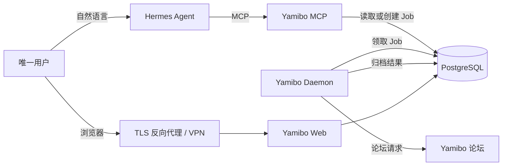
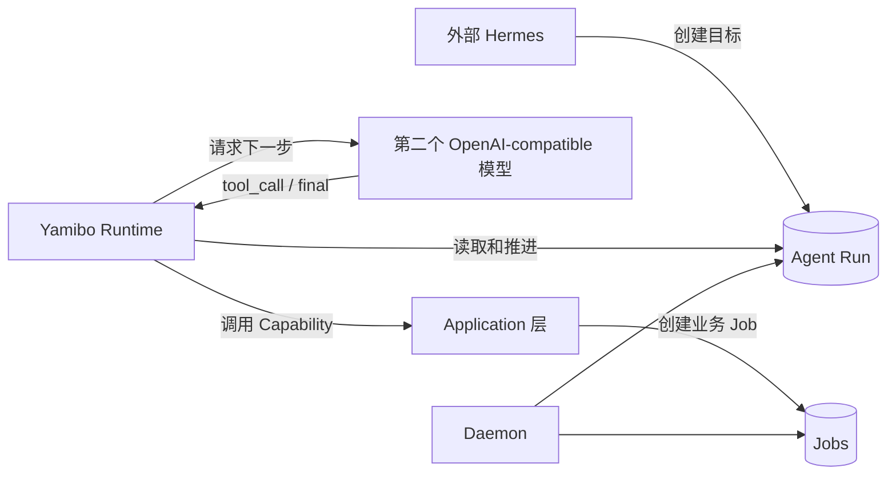
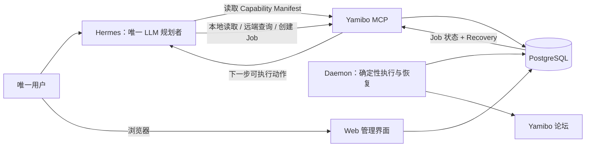

# Yamibo 个人项目架构审视与精简建议

> 文档定位：面向不熟悉代码和 Agent 技术的项目管理者
> 审视对象：已部署的 Yamibo 1.0.0，以及当前工作区中的 Phase A/B/C Agent Runtime 改动
> 审视日期：2026-08-08
> 结论类型：架构评估与方向建议，不代表相关精简工作已经实施

## 1. 管理摘要

Yamibo 1.0.0 的核心架构总体合理：PostgreSQL 保存数据，MCP 接收 Hermes 的工具调用，Daemon 在后台执行耗时任务，Web 提供人工管理界面。这些组件分别解决真实问题，不属于明显的过度设计。

当前工作区的 Phase A/B/C 改动则加入了一套完整的内部 Agent Runtime：它会持久化 Agent Run 和每一步决策，调用另一个 OpenAI-compatible 模型进行规划，再调用 Yamibo 自己的 MCP 能力。这套方案具备较强的可靠性和审计能力，但对于“单用户 NAS + Hermes 已经负责自然语言规划”的实际场景，存在明显的重复建设。

本报告的核心建议是：

1. 保留 1.0.0 的 PostgreSQL、Job、Daemon、MCP 和 Web 主架构。
2. 保留 Phase A 的机器可读能力契约，因为它能直接改善 Hermes 对工具的理解。
3. 优先增强 `read_job` 的错误分类、恢复建议和幂等重试信息。
4. 让已部署的 Hermes 继续作为唯一的 LLM 规划者，暂不再部署第二个内部 Agent 模型。
5. 暂缓 Phase B/C 的双 Run 状态机、审批表、Agent Artifact/Citation 表和 Web Chat Runtime 接入。
6. 只有在真实使用数据证明 Hermes 仍无法稳定完成多步流程时，再引入一套精简且唯一的 Runtime。

简化后的目标不是减少可靠性，而是把可靠性放回最确定的位置：Job、Daemon、错误分类、幂等性和数据库状态机负责可靠执行；LLM 只负责理解自然语言和选择工具。

## 2. 先理解几个概念

| 名称 | 管理者可以怎样理解 | 当前职责 |
|---|---|---|
| Web | 后台管理页面 | 查看帖子、任务、日志、配置和归档结果 |
| Hermes | 接待员兼任务理解者 | 接收自然语言，决定调用哪个 MCP 工具 |
| MCP | 标准化操作窗口 | 向 Hermes 暴露搜索、归档、读取和查询任务等工具 |
| Job | 后台工单 | 表示一次归档、更新、导出或索引任务 |
| Daemon | 后台执行人员 | 领取 Job、抓取论坛、下载图片并写入数据库 |
| PostgreSQL | 中央档案库 | 保存帖子、任务、事件、索引和分析数据 |
| Agent Run | 一次 Agent 目标的执行档案 | 记录模型规划、工具调用、审批和最终回答 |
| Capability | 对 MCP 工具的机器可读说明 | 描述参数、副作用、风险、重试方式和后续动作 |

最容易混淆的是 Job 和 Agent Run：

- Job 表示“系统正在执行一项实际工作”，例如归档某个帖子。
- Agent Run 表示“模型为了完成一个目标，进行了哪些判断和工具调用”。
- 对大型、多用户 Agent 平台，两者分开很有价值。
- 对当前个人项目，如果 Hermes 已经完成规划，额外保存完整 Run 的收益需要用真实场景证明。

## 3. 当前已部署的 1.0.0

### 3.1 实际部署链路



### 3.2 一次归档请求是怎样完成的

1. 用户对 Hermes 说“归档这个帖子”。
2. Hermes 调用 `create_thread_archive_job`。
3. MCP 在 PostgreSQL 中创建一条 Job，立即返回 `job_id`。
4. Daemon 从数据库领取 Job，执行远端抓取、解析、图片下载和数据写入。
5. Hermes 调用 `read_job` 查询状态。
6. Job 成功后，Hermes 调用 `read_archived_thread` 读取结果。

这套机制的优点是：即使 Hermes 断开，Job 仍然保存在数据库中并由 Daemon 继续执行。

### 3.3 1.0.0 的主要问题

**证据：** `read_job` 已返回状态、阶段、错误码和通用诊断，但很多失败场景只给出“查看事件后再决定是否重试”的提示。对应实现位于 `src/yamibo_mcp/server/schemas.py`。

**推断：** Hermes 能看到错误，却不一定知道下一步应该调用什么、能否安全重试、是否会创建重复 Job。这与“出错后基本无法自行解决”的实际体验一致。

**证据：** 1.0 已有 `AgentError.agent_hint`、`suggested_actions`、`AgentResult.next_actions` 和 Job Event，但不同工具和错误路径并未形成一套统一的恢复协议。

**推断：** 当前最直接的问题不是缺少另一个 Agent，而是现有 MCP 返回没有把错误转换成足够明确、可执行的下一步动作。

## 4. Phase A/B/C 增加了什么



### 4.1 Phase A：能力说明书

Phase A 从现有公开 MCP 工具生成 Capability Manifest，描述：

- 参数和默认值
- 只读、远端读取或创建 Job
- 风险级别
- 是否可以安全重试
- 会返回哪个 Job ID
- Job 完成后应该读取什么
- 推荐的后续工具

**评价：保留。** 这是对 Hermes 最直接、成本较低的改进。它复用现有工具注册，不需要第二个模型，也不改变业务执行方式。主要实现位于 `src/yamibo_mcp/server/capabilities.py` 和 `src/yamibo_mcp/server/agent_tools.py`。

### 4.2 Phase B：持久化单步 Run

Phase B 为一次指定 Capability 的调用增加：Run、Step、Event、审批、主体、参数哈希、lease、Artifact 和 Citation。

**评价：对当前场景偏重。** 单步 Capability 原本已经可以通过 Job、Job Event 和幂等创建记录执行事实。再增加单步 Run，会形成两套需要理解和维护的状态。

### 4.3 Phase C：内部多步 Agent Runtime

Phase C 让 Yamibo Daemon 调用 OpenAI-compatible 模型。模型在每一轮返回一个 `tool_call` 或 `final`，Runtime 再进行参数验证、策略判断、执行和等待 Job。

**评价：能力完整，但与 Hermes 职责重叠。** 外部 Hermes 已经是自然语言 Agent；Phase C 相当于让一个 Agent 把任务转交给另一个 Agent，再由第二个 Agent 调用同一批工具。

## 5. 是否存在过度设计

### 5.1 排名结论

| 排名 | 判断 | 置信度 | 依据 |
|---|---|---|---|
| 1 | 内部 Runtime 与 Hermes 的规划职责重复 | 高 | 两者都负责从自然语言目标选择 MCP Capability |
| 2 | 单步 Run 与多步 Run 并存增加了重复状态机 | 高 | MCP 同时暴露 `create_agent_run` 和 `create_agent_runtime_run`，Daemon 同时推进两套 Run |
| 3 | PostgreSQL、Job、Daemon 和 lease 不是过度设计 | 高 | 归档和图片下载是长任务，必须支持断线继续和失败恢复 |
| 4 | Phase A Manifest 值得保留 | 高 | 它直接增强现有 Hermes，不引入第二套执行系统 |
| 5 | Approval、Subject、HMAC 对单用户部署偏重 | 中 | 当前只有 `nas-owner`，但若 Agent Run Web API 暴露公网，这些安全机制又是必要的 |
| 6 | Artifact/Citation Hash 对普通归档操作偏重 | 中 | 研究报告需要证据可复核；普通搜索、归档和更新不一定需要 |

### 5.2 可量化的复杂度

当前工作区的主要 Agent Runtime 新文件约包含：

- 约 2,250 行生产、迁移和 Agent Run UI 代码
- 约 1,200 行定向单元测试
- 6 张 Agent 专用表：`agent_runs`、`agent_steps`、`agent_run_events`、`agent_approvals`、`agent_artifacts`、`agent_citations`
- 9 个 Runtime 控制 MCP 工具
- 单步 Run 和多步 Run 两套创建、审批、取消、等待和恢复路径

这些数字不能单独证明设计错误，但说明它已经不是一个“小型辅助功能”，而是一套新的执行子系统。

### 5.3 代码结构是否简洁

**1.0 主体：基本清晰。** MCP、Application、Daemon、Repository 和 Domain 分层明确；耗时工作统一进入 Job，业务逻辑没有放进 Web 或 MCP 适配器。

**Phase A：方向清晰，但元数据较多。** `agent_tools.py` 因每个工具都增加 effect、risk、idempotency、followups 等字段而显著增长。这些字段有实际用途，但应避免继续扩展成通用工作流语言。

**Phase B/C：结构开始变复杂。** 主要信号包括：

- `agent_runtime/orchestrator.py` 从 `application/agent_runs.py` 导入多个私有函数，模块边界耦合。
- `application/agent_runs.py` 同时承担 policy、参数校验、执行、审批和状态推进。
- Daemon 每轮同时调用单步执行、单步等待、多步等待、审批过期和多步规划五条推进路径。
- 新增代码中存在超过 50 行的函数，与项目偏好的函数长度不一致。
- 初始 Agent Migration 一次创建六张表，`downgrade()` 为空，回退能力有限。

**推断：** 当前代码可以运行，也有较多测试，但维护者必须同时理解 Job 状态机、单步 Run 状态机和多步 Runtime 状态机。对于只有一名维护者的个人项目，这会提高未来修改和排错成本。

## 6. 哪些应该保留、简化或延后

| 能力 | 建议 | 原因 |
|---|---|---|
| PostgreSQL + pgvector | 保留 | 已有真实数据，趋势分析和向量检索依赖 PostgreSQL |
| Job + Job Event | 保留 | 是耗时任务断线执行和排障的核心 |
| Daemon + lease | 保留 | 防止任务因请求断开而丢失，并支持进程恢复 |
| 独立 MCP 服务 | 保留 | Hermes 需要稳定的标准协议入口 |
| Web + Daemon 同容器 | 保留 | 对单 NAS 足够简单，不必继续拆服务 |
| Phase A Capability Manifest | 保留 | 直接改善 Hermes 对工具、副作用和后续动作的理解 |
| 结构化 Job Recovery | 新增 | 直接解决当前错误无法自救的问题 |
| 单步 Agent Run | 暂缓 | 与 Job 执行事实重复，当前没有独立业务价值 |
| 多步内部 Runtime | 暂缓 | 与 Hermes 规划职责重复，且需要第二个模型入口 |
| Approval/Subject 多主体模型 | 暂缓 | 当前只有一名用户；破坏性工具可以不暴露给 MCP |
| Agent Artifact/Citation 表 | 按需 | 普通操作不需要；研究报告需要时再启用 |
| Web Chat Runtime 模式 | 不纳入 | 对话页目前不使用 |
| Phase D 多租户/跨实例 | 不做 | 与个人 NAS 场景无关 |

## 7. 推荐的精简目标架构



这个架构只有一个负责“思考”的 Agent：Hermes。Yamibo 不再调用第二个 LLM，而是提供更可靠、更细的事实和恢复动作。

### 7.1 Job Recovery 应返回什么

建议在现有 `read_job` 中以兼容方式增加：

```json
{
  "recovery": {
    "classification": "continue_waiting",
    "reason_code": "REMOTE_MAINTENANCE",
    "failed_stage": "fetch_thread",
    "retryable": true,
    "retry_after_seconds": 600,
    "requires_user_action": false,
    "next_actions": [
      {
        "tool": "read_job",
        "args": {"job_id": "job_xxx"},
        "reason": "Daemon 会在维护结束后自动恢复，不要重复创建任务"
      }
    ]
  }
}
```

这不是让 LLM 自己猜，而是由 Yamibo 根据错误码和 Job 状态给出确定答案。

### 7.2 自动恢复边界

- 论坛维护、短时网络失败、HTTP 429、Daemon 中断：由 Job/Daemon 确定性等待或重试。
- 已存在的活动 Job：返回原 Job，禁止重复创建。
- Cookie 失效、权限不足、配置错误：停止自动重试，明确通知用户。
- `partial`：允许读取已有归档，并指出缺失内容；不自动重跑整个任务。
- 删除、重置、清理数据：不向 Hermes 暴露。

## 8. 分阶段改进方向

### 阶段一：Phase A+

目标：不增加第二个 Agent，只解决 Hermes 看不懂工具和错误的问题。

- 保留 Capability Manifest。
- 为 `read_job` 增加统一 Recovery 对象。
- 将 `error_code` 映射为明确的 retry、wait、user_action 或 stop。
- 给 Hermes 固定工作流说明：先看 effect 和 idempotency，再调用工具。
- 用真实失败样本验证维护、反爬、权限、Cookie、Daemon 中断和部分成功。

### 阶段二：观察真实使用

连续记录至少 20 次真实 Hermes 请求，统计：

- 任务一次完成率
- 需要人工介入的比例
- 重复创建 Job 的次数
- 错误发生后是否调用了正确的下一步工具
- 用户是否经常需要手工拼接三步以上工作流

### 阶段三：满足条件后再考虑 Runtime

只有出现以下情况，才重新评估内部 Runtime：

- 即使有结构化 Recovery，Hermes 仍频繁选错工具。
- 用户需要离线运行很久的自主研究任务。
- 一个目标通常包含多个相互依赖的 Job。
- 必须保留每一步模型判断用于审计或复现。

如果确实需要，应只保留一套多步 Runtime，不再同时提供单步 Run；并优先复用现有 Job、Event、lease 和错误分类。

## 9. 预期结果

采用精简方案后，预期得到以下变化：

| 指标 | 当前 | 目标 |
|---|---|---|
| LLM 规划者数量 | Hermes + 内部 Runtime 模型 | 1 个 Hermes |
| 业务执行状态机 | Job + 单步 Run + 多步 Run | 1 套 Job 主状态机 |
| 模型服务依赖 | Hermes 之外还需 Runtime 模型入口 | 不新增 |
| 错误处理 | 文本提示，Hermes 自行猜测 | 结构化分类和下一步动作 |
| 重复任务风险 | 依赖 Hermes 正确理解状态 | 由幂等规则和 Job 状态限制 |
| Web Chat 改动 | 需要维护 Runtime 模式 | 不纳入当前范围 |
| 个人维护成本 | 需理解三套执行事实 | 主要理解 Job 和 MCP |

管理层面的预期是：功能不减少，部署组件不增加，错误处理更可靠，代码维护边界更清楚；同时保留未来引入 Runtime 的可能性，但不为尚未发生的需求提前支付复杂度成本。

## 10. 风险与未知项

### 已知风险

- Phase A/B/C 当前仍是本地工作区改动，不应把文档中的完成度等同于已部署生产版本。
- 如果直接删除已经完成的 Runtime 代码，会产生额外返工；应先决定是否以实验分支保留。
- Web 和 MCP 都具备有副作用的操作，外网访问必须经过 TLS 和身份认证，不能直接公开端口。

### 当前未知

- Hermes 是否会自动读取 MCP Resource 中的 Capability Manifest。
- Hermes 当前最常见的真实错误码及占比。
- NAS 上的反向代理是否已经对 Web 和 Hermes 实施可靠身份认证。
- 是否存在必须长时间无人值守执行的多步 Agent 任务。

这些未知项不会阻止 Phase A+，但会影响以后是否值得恢复内部 Runtime。

## 11. 最终建议

对于当前个人项目，推荐选择“1.0 核心 + Phase A+”，而不是直接部署完整 Phase B/C。

最值得优先投入的不是第二个模型和更复杂的 Agent 状态机，而是：

1. 让 Hermes 准确知道每个工具会做什么。
2. 让 Job 明确说明为什么失败。
3. 让系统明确给出是否能重试、何时重试、下一步调用什么。
4. 让已知的短时故障由 Daemon 自动恢复。
5. 让需要人工处理的权限、Cookie 和配置问题尽快停止并通知用户。

这条路径更符合个人项目的实际投入产出比，也更符合“优先复用已有机制、只写解决真实问题的最少代码”的工程原则。

## 12. 主要证据位置

- `docker-compose.yml`：当前 PostgreSQL、Web/Daemon 和 MCP 容器边界
- `src/yamibo_mcp/server/schemas.py`：Job 状态和诊断返回
- `src/yamibo_mcp/server/capabilities.py`：Phase A Capability Manifest
- `src/yamibo_mcp/server/agent_tools.py`：公开 MCP 工具和 Runtime 控制工具
- `src/yamibo_mcp/application/agent_runs.py`：单步 Run、Policy、Approval 和执行逻辑
- `src/yamibo_mcp/agent_runtime/orchestrator.py`：多步模型循环、预算、Job 等待和证据读取
- `src/yamibo_mcp/daemon/runner.py`：Job 与两套 Run 的轮询推进
- `alembic/versions/009_add_agent_runtime.py`：Agent Runtime 六张核心表
- `docs/LLM原生运行时路线图.md`：ABC 状态、目标和剩余发布门禁
