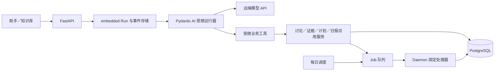

# 对话—知识库 Agent 选型与部署决策

日期：2026-09-24。状态：Agent 框架选择已体现在本地实现；RK3588 NAS 真机和生产模型端点尚未验收。适用范围：讨论类问答、日报内容生成、归档／导出委托。部署目标是 RK3588 NAS 的 Linux ARM64 Docker；模型推理通过云端或其它主机的 API 完成，不在 NAS 中加载模型权重。产品能力与批次仍以[现行总纲](对话—知识库改造方案.md)和[实施架构](对话—知识库实施架构与任务拆解.md)为准；实现路径见[实现指南](对话与知识库改造实现指南.md)。

## 决定

**以项目已有的 embedded Pydantic AI 运行器承接 Hermes 的对话职责。** 短期继续使用 Pydantic AI v1 分支，经测试把锁定的 1.107.5 更新到维护补丁 1.107.6；v2 升级单列紧邻里程碑，不作为停用 Hermes 的前置。生产部署显式选择 embedded 后端和一个经契约测试的远端模型端点；新安装默认值随迁移修改。Hermes 可在过渡期间保留只读兼容或回滚代码，但三条主业务链和验收不得依赖它。

这里选的是 **Agent 执行框架**，不是具体模型。Pydantic AI 负责有限的模型循环、工具参数解析／校验、流式模型事件和输出解析；Yamibo 的应用服务负责来源范围、授权、统计、预算、Job、日报期次和结果事实。论坛原文和模型输出都是不可信输入，工具的访问权限在宿主服务执行，不因模型选型而放宽。**开发验证改用本机 OpenAI 兼容接口的 `gemini-3.8-flash-high`；由 Pydantic AI 直接调用，不再使用 Codex CLI 桥接。**具体接法和验收层级见[分步实施与验证细则](对话—知识库分步实施与验证细则.md)。

用户仍只看到一个助手。交互式问答与后台日报可以用同一框架、不同的受限工具和预算配置；它们不是两个拥有独立会话与记忆的“人格 Agent”。归档／导出固定链由 Daemon 根据批准的计划推进；Run 入队后可结束，不让模型等待整段归档。日报调度器也不维持跨天的模型会话。当前 embedded Run 在进程重启后会记录为 interrupted，**并无中间推理断点恢复**；这不妨碍持久化业务任务继续，但 UI 必须诚实显示对话中断。[运行器](../src/yamibo_mcp/services/embedded_chat/runtime.py#L110)、[操作策略](../src/yamibo_mcp/services/embedded_chat/policy.py#L49)、[会话存储](../src/yamibo_mcp/services/embedded_chat/store.py#L21)。

## 为什么选它

当前依赖已声明 `pydantic-ai-slim[mcp,openai]>=1.0,<2`，锁文件为 1.107.5；embedded 路径已经使用 `AsyncOpenAI`、`OpenAIProvider`、`OpenAIChatModel` 和 `Agent.run_stream_events()`，并通过独立的 SSE API 输出事件。[依赖](../pyproject.toml#L17)、[模型调用](../src/yamibo_mcp/services/embedded_chat/runtime.py#L487)、[SSE](../src/yamibo_mcp/web_fastapi/routers/chat.py#L88)。因此替代 Hermes 首先是**把已存在的内置路径收口为正式路径**，不是从零引入第二套 Agent 平台。Pydantic 官方说明 `OpenAIChatModel` 可连接自定义 OpenAI-compatible API；v2 也应显式使用 Chat Completions 路径和正确的模型 profile，不能因为 endpoint 名称类似 OpenAI 就假定全部工具协议兼容。[Pydantic 模型文档](https://pydantic.dev/docs/ai/models/openai/)。

| 候选 | 对当前需求的判断 | 采用条件 |
|---|---|---|
| Pydantic AI | 主选；现有代码、受限工具、Run／事件存储可延续。它的 deferred tools 能表达等待审批或外部结果，但不会自动替 Yamibo 保证 Job 唯一性和业务恢复。[官方延后工具](https://pydantic.dev/docs/ai/tools-toolsets/deferred-tools/) | 在目标 ARM64 镜像和真实模型端点通过下文四条验收 |
| OpenAI Agents SDK | 合格备选；官方区分由 SDK 管理 Agent 循环、由应用自己管理部署、存储和授权。换用它需要重写当前模型循环与消息／事件适配，对固定业务链没有直接增益。[OpenAI Docs](https://developers.openai.com/api/docs/guides/agents/sdk)、[模型与 provider](https://developers.openai.com/api/docs/guides/agents/models) | Pydantic AI 的框架级缺陷经定位无法解决，且同用例原型证明 SDK 明显改善 |
| LangGraph | 有图状态、检查点和中断恢复；当前跨小时流程是确定的归档／导出与日报状态机，已经归属 Yamibo Job。引入图级持久化会形成第二套执行状态。[官方持久化](https://docs.langchain.com/oss/python/langgraph/persistence) | 今后确有多分支、跨小时且必须恢复中间模型推理的工作流，再单独评估 |
| 自写模型循环 | 依赖少，但流式 tool call 拼接、schema、超时、取消、消息兼容和 provider 差异都须长期维护 | 仅保留作端点契约测试基线，不作为首版生产运行器 |

这是对 Yamibo 目标的工程取舍，不是对框架通用质量的排名。选型不能代替模型选择：最终端点须用真实中文讨论样例验证检索选择、补读、正确引用、工具失败恢复和日报摘要质量。

## 迁移与版本路径

1. **隔离当前路径。** 核对现行 Docker 部署实际 `chat_backend`、模型端点、旧 Hermes 会话保存位置及是否需要历史记录。旧 Hermes Run ID 不转换成 embedded Run ID；若需保留历史，迁移为明确的只读对话记录或保留有期限的只读入口。当前 `chat_backend` 默认仍为 `hermes`，Compose 也没有显式选择 embedded，因此仅修改模型地址不能完成迁移。[配置](../src/yamibo_mcp/config.py#L115)、[应用创建](../src/yamibo_mcp/web_fastapi/app.py#L40)、[Compose](../docker-compose.yml#L45)。
2. **维护补丁与回归。** 在独立变更中把 Pydantic AI v1 锁定到经测试的 1.107.6，并跑现有 Run／MCP／SSE／审批测试。[v1.107.6 发布说明](https://github.com/pydantic/pydantic-ai/releases/tag/v1.107.6)列出四项安全修复；现行 1.107.5 属于其中部分公告的受影响版本，但是否触发取决于实际功能与配置，不能断言 Yamibo 已暴露。[遥测公告](https://github.com/pydantic/pydantic-ai/security/advisories/GHSA-4x9p-g9wm-8q7f)。
3. **显式切换宿主。** 调整配置默认及 Compose 环境为 embedded，准备远端模型 `base_url`、`model` 和服务端密钥，前端能力列表只依据内置宿主。保留现有 `/api/chat` 传输和 `Last-Event-ID` 回放；业务工具通过相同应用服务实施范围与授权。当前受限 MCP stdio 可作为过渡工具面；测得启动开销或稳定性问题后再移为进程内函数工具，外部 MCP 可继续使用同一业务层。[现有工具白名单](../src/yamibo_mcp/services/embedded_chat/mcp.py#L18)、[SSE](../src/yamibo_mcp/web_fastapi/routers/chat.py#L88)。
4. **对接三条业务链。** 讨论发现／阅读只返回实际回执；提出归档／导出计划与批准分离；日报由后台 Job 请求有界模型生成。模型不能直接执行任意 SQL、通用 Shell、任意网页抓取，也不能自行决定 Job 已完成。[实施架构](对话—知识库实施架构与任务拆解.md)。
5. **单独升级 v2。** 官方称 v1 在 v2 于 2026-06-23 正式发布后至少六个月提供安全修复；这不是永久支持，也不表示到期当天必然停更。[版本政策](https://pydantic.dev/docs/ai/project/version-policy/)。v2 的 `openai:` 默认改为 Responses，Chat Completions 要显式 `openai-chat:` 或 `OpenAIChatModel`；默认 `end_strategy` 等也改变。迁移前固定 Run 历史序列化格式、消除弃用警告，并做事件／工具／审批回归；不与 Hermes 切换混成同一大变更。[迁移表](https://pydantic.dev/docs/ai/overview/migration/)。

## RK3588 Docker 与模型端点验收

NAS 只运行 Agent 控制逻辑、HTTP 模型客户端、FastAPI、Daemon 和数据库连接，不把本地模型推理作为此方案依赖。Dockerfile 使用 `python:3.12-slim` 与 `uv sync --locked`；当前 CI 未验证 `linux/arm64`，锁文件含原生依赖。PyPI 单个 wheel 的存在不能证明完整镜像可用。[Dockerfile](../Dockerfile#L1)、[CI](../.github/workflows/ci.yml#L53)。

先在目标基础镜像构建 `linux/arm64`，再于 RK3588 真机运行。检查 Python `aarch64`、全量锁文件安装、`pydantic_ai`／`pydantic_core`／`quickjs`／`psycopg` 导入、PostgreSQL 与 pgvector 连接、一个 Run 加一个后台 Job 的 RSS 和取消延迟。当前 QuickJS 可能走源码构建，浏览器回退依赖也须单独验证；这些是整个 Yamibo 镜像的门槛，不能只因 Agent 包是 Python wheel 就判定通过。[QuickJS 锁定](../uv.lock#L1695)、[浏览器回退](../src/yamibo_mcp/yamibo/browser_fallback.py#L44)。

真实模型端点至少通过四组契约用例：中文流式回答和重连；有参数校验的 `find_discussions → read_discussion` 多轮工具调用；计划确认后只创建一个 Job，模型超时或断线不扩大授权；日报模型生成失败时保留统计事实并形成明确的部分／失败状态。另测模型 API 401／429／5xx、慢响应、取消和重复提交。健康检查成功只证明可连接，不证明工具协议和中文内容质量。费用、token／请求预算和 endpoint 密钥均留在服务端，日志不输出凭据或长段原文。

这是当时的实施门槛。当前本地 Pydantic AI 路径已实现；尚未据此确认 RK3588 ARM64 镜像、生产模型端点和线上切换通过。部署状态见[实现指南](对话与知识库改造实现指南.md)。

## 本地模型验证端点

开发验证使用 `http://127.0.0.1:8317/v1` 和模型 `gemini-3.8-flash-high`，凭证仅由测试进程通过 `YAMIBO_LLM_API_KEY` 注入，不写进仓库、文档、Compose 或测试快照。现有 `runtime.py` 已由 `AsyncOpenAI(base_url, api_key)`、`OpenAIProvider` 和 `OpenAIChatModel` 建立 Pydantic AI 模型，无需新增 CLI 适配器。[当前模型调用](../src/yamibo_mcp/services/embedded_chat/runtime.py#L525)。

2026-09-25 最小探针使用当时锁定的 Pydantic AI 1.107.5：`/v1/models` 和一个只读工具循环通过。当前 `pyproject.toml` 锁定 1.107.6；探针结果不等于这个补丁版及完整项目路径已重新验收。`127.0.0.1` 只代表开发机；NAS 容器必须配置容器可达的模型主机地址。
