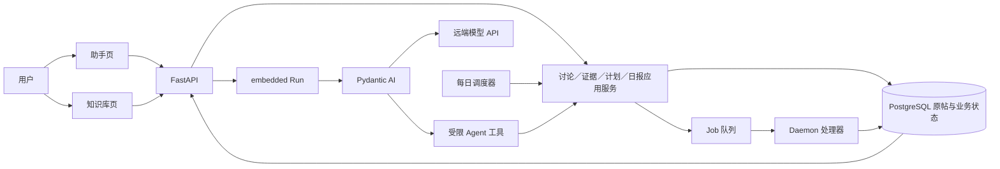

# 对话—知识库实施架构与任务拆解

日期：2026-09-24。状态：目标架构与实施拆解；本地实现状态见[实现指南](对话与知识库改造实现指南.md)，本文未完成的内容仍是计划。产品范围与验收目标以[现行总纲](对话—知识库改造方案.md)为准；Agent 规则、日报／归档导出契约、Agent 选型和分步验证细则是专项约束。只处理讨论类帖子。本地离线副本只用于验证内容形态，不用于推断线上完整性。本文不授权生产部署或数据库破坏性操作。

## 1. 目标架构与依赖方向

用户入口只有助手和知识库，业务事实存放在 Yamibo 服务端。模型是可替换的推理执行者；应用层承担所有不可交给模型判断的约束。

| 层 | 职责 | 拟新增或修改的位置 |
|---|---|---|
| React | 助手的消息、范围、资料／任务／日报卡；知识库搜索、日报历史与详情 | c/src/pages/Chat.tsx、Rag.tsx、App.tsx，c/src/api/client.ts 及独立组件 |
| FastAPI | 严格参数校验、访问控制、请求幂等和资源读取；不写业务 SQL | web_fastapi/routers/chat.py、knowledge.py，新建 assistant_operations.py、daily_briefs.py |
| 应用服务 | 讨论发现／阅读、证据、计划、日报规则、期次和成果的业务不变量 | application/ 中的 discussion_discovery_queries.py、assistant_evidence_queries.py、operation_plan_commands.py、operation_plan_queries.py、daily_brief_commands.py、daily_brief_queries.py |
| 仓储 | 显式 SQL、唯一约束和事务；原帖仍以 threads/floors 为权威 | db/repositories/ 与新 Alembic 迁移 |
| Daemon | Job 租约与重试、固定操作链推进、近期资料准备、日报生成与定时检查 | daemon/runner.py、handlers/ 和专用 scheduler |
| Agent 适配 | NAS 内嵌 Pydantic AI 运行器；通过 API 调用云端或其它主机的模型，暴露少量受限业务能力 | services/embedded_chat/mcp.py、runtime.py、policy.py；迁移后 Hermes 不在主链路 |

现有 Job 统一从 JobsRepository 入队、Daemon 领取并分派处理器，可承担可恢复的执行阶段：[仓储](../src/yamibo_mcp/db/repositories/jobs.py#L278)、[Daemon](../src/yamibo_mcp/daemon/runner.py#L197)、[分派](../src/yamibo_mcp/daemon/handlers/__init__.py#L18)。现有 embedded Store 采用 JSON 行存会话／Run／操作和单独事件表，适合继续承载对话状态，但日报期次、操作计划和查询索引应成为有约束的业务表，避免依靠遍历 JSON 保证唯一性：[Store](../src/yamibo_mcp/services/embedded_chat/store.py#L21)、[迁移 017](../alembic/versions/017_embedded_chat.py#L1)。

三条业务链共用“讨论发现→有界读取→来源回执”。归档和日报各有固定状态机；不做通用 DAG／插件执行器。知识库只是读取业务成果的入口，不运行定时任务，也不依赖一个打开的 Chat Run。

## 2. 首版能力集收口

| 能力 | 进入当前目标 | 边界 |
|---|---|---|
| 讨论发现 | 是，标题、板块、正文关键词、已知 TID；发现与指定资料双模式 | 无需 Embedding；只给候选与命中理由，不伪称已读 |
| 讨论有界阅读与问答 | 是，原回复、上下文、更正、来源回执 | 模型负责解释，程序校验引用与预算 |
| 每日规则及手动／自动日报 | 是，板块、时间、日期、活跃和值得看两栏、历史追问 | 统计只计目标日，背景另列；数据不足可部分／失败 |
| 归档／更新／导出 | 是，准确对象、完整计划、一次授权、逐帖固定衔接 | 自动续作只限已定义步骤；每帖独立结果 |
| 会话内选帖 | 是，Run 冻结范围 | 不称为跨会话“已保存资料集” |
| 笔记编辑、具名资料集、邮件、通用调度、任意网页抓取、全库向量重建 | 否，后续 | 不出现在首版入口或能力清单中 |

助手页展示会话、当前资料范围、回答与来源、日报／操作任务卡及其真实阶段、待确认的完整计划；即使某条后台任务仍在运行，输入框也不被它占用。知识库首页展示讨论搜索、最近日报与资料检查状态；讨论详情提供原文与“带这些帖子问助手”，日报详情提供固定版本、两类来源、“继续追问”和“选帖处理”。旧 `/rag` 入口可兼容转向知识库，索引维护移到二级入口。两页共用服务端的范围和成果 ID，而非互相复制消息。首版不展示空白的笔记／资料集编辑器。

模型工具面限定为以下业务动作；工具名称和字段在实现时固化为带版本的 schema，Web 页面可调用同一应用服务：

| 工具 | 输入和输出 | 不能越过的边界 |
|---|---|---|
| find_discussions | 冻结 scope_id、问题、候选上限 → TID、命中理由 | 只返回候选，不提供“已读”证据 |
| read_discussion | scope_id、TID/PID、上下文与预算 → 原文片段、receipt_id | 只读授权范围，超预算返回截断位置 |
| read_discussion_stats | 目标日、板块、issue_id → 统计和聚合回执 | 只读已核定窗口，不由模型重算排名 |
| get_or_generate_daily_brief | issue_id 或日期与规则 → 现有报告／创建回执 | 新建期次由应用服务去重；不能把入队称为已生成 |
| manage_daily_rule | 规则草案／rule_id、版本和操作 → 规则状态 | 创建和修改持久化规则前显示确定的配置与下次执行时间 |
| propose_operation_plan | 确定 TID、来源、步骤和格式 → 可审阅的计划 | 仅提出；批准必须通过绑定计划摘要的独立操作 |
| get_operation_result | plan_id → 逐帖阶段、Job、文件 | 只读真实业务状态，未知结果继续核查 |

模型不能直接调用底层 SQL、任意 Job 类型或任意下载地址，也不能把原帖中的文字当作系统指令。后台规则调度无需模型常驻。能力元数据应由服务端返回，前端按实际可用能力展示，而非只靠欢迎语承诺。

Chat 当前默认后端配置为 Hermes，但仓库已有 Pydantic AI embedded 实现：[设置](../src/yamibo_mcp/config.py#L115)、[模型调用](../src/yamibo_mcp/services/embedded_chat/runtime.py#L487)。实施时显式把配置及 Compose 主路径切到 embedded；前后端接口和业务 API 不以 Hermes 为依赖。旧会话保存位置先核对，必要时保留只读历史，不把 Hermes Run ID 冒充 embedded Run。NAS 不运行模型推理，真实模型端点的工具协议和 ARM64 镜像均需实测；开发验证由 Pydantic AI 直接调用本机 OpenAI 兼容模型接口，正式部署端点另行配置和验收。v1 补丁及后续 v2 迁移按[选型决策](对话—知识库%20Agent%20选型与部署决策.md)分开处理。

## 3. 讨论发现与证据：最先打通的公共能力

现有归档列表搜索主要命中标题／预览；现有正文关键词搜索读取 rag_chunks，并受 rag_enabled 门控：[帖子筛选](../src/yamibo_mcp/db/repositories/threads.py#L29)、[分块查询](../src/yamibo_mcp/db/repositories/rag_chunks.py#L492)、[RAG 门控](../src/yamibo_mcp/application/rag_queries.py#L19)。这条路径不能直接视作覆盖所有原始讨论正文。第一批需要独立的原文文本发现接口，不以向量或现存分块为前提。

实施建议：

1. 新增 discussion_search 查询对象，先以论坛目录的 discussion 分类限制可选板块，再校验原帖的 content_kind；明确为非讨论或板块未知的帖子排除，旧记录的空分类在批次 0 核对分布后制定可审计的回填／兼容规则。标题命中和 floors.content 命中归并为按 TID 的候选，返回命中 PID、发表时间、片段和实际检索方式。[论坛分类](../src/yamibo_mcp/domain/forums.py#L23)、[原帖字段](../alembic/versions/001_initial_schema.py#L58)。先做针对真实问题的 PostgreSQL 负载实验，确定索引方案；优先利用现有数据库能力，若短中文词无法达到延迟目标，再增加专用 n-gram 索引，不让线上请求无界扫描全文。
2. 所有过滤先于 Top K；无结果、索引未准备、检索失败分别返回。查询限制候选数、最大扫描范围和超时；支持明确 TID 与已选 TID 集。保留现有 RAG 接口作为维护／可选语义增强，不把新业务接口隐式复用为旧分块搜索。
3. 读取沿用应用层原帖接口，但为 Agent 提供稳定的 PID 位置、按实际字节分段、按上次排序键的游标或版本检测。现有读取使用 offset 游标，内容变化时可能漏／重：[archive_queries.py](../src/yamibo_mcp/application/archive_queries.py#L95)。引文身份使用 TID+PID，楼层号只展示。
4. 每次实际读取生成 receipt_id、Run ID、TID/PID、字节／段落范围、发表时间、源内容哈希、片段和截断信息；不把整篇长帖反复写入聊天事件。候选只存候选回执。回答引用必须匹配本 Run 的读取回执；日报报告版本复制所需片段与来源坐标，删除聊天后仍可打开。
5. 发现模式冻结板块／时间／来源，指定资料模式冻结 TID/PID。服务端在搜索和读取时取交集；旧工作文件、远端工具和历史笔记不能绕开指定资料范围。日报可补读同一帖的早期背景，但统计仍只计目标日。

现有 start_run 请求只带 input 与 client_request_id，去重时只比较文本：[路由](../src/yamibo_mcp/web_fastapi/routers/chat.py#L15)、[运行器](../src/yamibo_mcp/services/embedded_chat/runtime.py#L230)。改造时提交模式、冻结范围、可选报告版本；幂等键校验输入与这些字段的规范化摘要，相同 request_id 改范围返回 409。scope_id 由服务端签发并绑定访问主体、会话、模式和范围，不能由模型任意声明；范围写入服务端 Run 记录，不只注入提示词。

## 4. 固定归档／导出任务链

新增 operation_plan 与 operation_item 两级持久化对象。Plan 记录来源（用户 TID／选择／report_id+revision+栏目）、冻结目标、操作步骤、准备策略、导出类型、授权快照、请求标识和总状态；Item 按 TID 记录当前阶段、归档 Job、导出 Job、已存在成果、失败和文件引用。唯一约束至少覆盖 plan_request_id、(plan_id, tid)、(plan_id, tid, step_kind) 的阶段回执，防止重复创建。

状态建议：draft → awaiting_approval → active → succeeded / partial / failed / cancelled；单帖为 check_existing → archive_or_update → verify_ready → export → verify_file → terminal。状态转移在数据库事务中检查当前阶段，锁定计划／Item；提交 Job 时写入步骤关联。需核查 JobsRepository.create 的内部提交行为，再确定“创建 Job 与关联回执同事务”的实现，不能假定当前仓储已提供这个原子边界：[jobs.py](../src/yamibo_mcp/db/repositories/jobs.py#L278)。

授权一次覆盖完整目标及可能的准备／导出行为；授权后服务端只执行被冻结的步骤。默认逐帖推进，失败帖止于失败阶段，其余继续。重启或 Job 结果未知时按 plan/item 回执与 Job 状态恢复，不能重做已提交步骤。Job 卡展示每帖阶段和文件；最终完成由服务端校验实际导出成果，不由 Agent 或 Job 创建回执宣告。现有单帖归档／导出命令和导出处理器可复用：[归档命令](../src/yamibo_mcp/application/archive_commands.py#L24)、[导出命令](../src/yamibo_mcp/application/archive_commands.py#L179)、[导出处理器](../src/yamibo_mcp/daemon/handlers/export_thread.py#L34)。

交互式“归档后再做开放式研究”仍可交接给用户下一次 Run；“归档后导出”必须由这个固定后台链自动继续。停止聊天不取消已授权链。用户在任务详情明确取消时，处理尚未开始的步骤并向正在运行的 Job 发出可支持的取消请求。

## 5. 日报的资料准备、期次与生成

日报新增四类持久化事实：

| 对象 | 主键／唯一性 | 核心数据 |
|---|---|---|
| daily_rule | rule_id，revision 单调递增 | 板块、执行时间、时区、栏目、条目及资源预算、状态 |
| daily_issue | issue_id；定时期唯一(rule_id, target_day)，手动期唯一(manual_issue_key) | 来源类型、创建时的规则／手动配置快照、统计窗、资料截止时间、期次状态 |
| daily_attempt | attempt_id；唯一(issue_id, attempt_no) | Job、开始结束时间、同步检查快照、错误或部分原因 |
| daily_report_revision | 唯一(issue_id, report_revision) | 结构化栏目、正文、统计回执、原文引用、生成时间、补报原因 |

首次创建定时期 issue 冻结 rule_revision；手动期冻结请求中的板块、日期、预算和来源。manual_issue_key 由访问主体、目标日、时区和规范化的板块／生成配置计算；相同配置再次请求返回同一期，只有显式“重新生成”才新增报告版本。client_request_id 另用于同一提交的网络重试去重。自动调度重复检查只复用该期；失败重试创建 attempt，不换期；明确补报创建报告 revision，不覆盖历史。当天执行时点之后新建规则默认次日生效；暂停不补跑，恢复从下一执行点开始。非暂停停机补跑最多最近一个且在 48 小时内的目标日，旧日手动补报。用户选择其它策略时须在配置中明确。时区显示在配置和报告详情；同一天的判断不可跟随服务器／浏览器时区漂移。

Daemon 已有签到每日入队的先例，但日报需独立规则仓储和唯一约束：[签到调度器](../src/yamibo_mcp/daemon/daily_sign_in_scheduler.py#L22)、[轮询入口](../src/yamibo_mcp/daemon/runner.py#L197)。调度器只决定到期与期次，不运行模型。日报 Job 经资料准备→候选聚合→有界补读→生成→保存。资料准备绑定指定板块的既有论坛列表扫描与同步 Job，记录检查页、快照时间、边界是否扫到、候选 TID 的终态。当前 resync planner 可提供扫描页／候选报告作为参考：[thread_resync_planner.py](../src/yamibo_mcp/application/thread_resync_planner.py#L16)。达到页数预算仍未扫到目标日边界，或候选同步未完成，到截止时间按规则保存部分日报或明确失败；最新回复时间本身不能证明全覆盖。

活跃指标由程序按目标日楼层发表时间及唯一 PID 聚合，明确首帖／无时间楼层口径；旧帖昨日新回复可入榜。模型只在候选集合中整理“值得看”及内容，不篡改统计排序。目标日前的同帖背景另标阅读，目标日后的更正另标发生时间。现有趋势构建、报告 Job 与知识研究查询可复用算法或结构，但当前报告是规则聚合模板、按 forum_id/日期读取且未直接实现“昨日热门帖子日报”：[趋势构建](../src/yamibo_mcp/application/discussion_trend_builder.py#L179)、[报告生成](../src/yamibo_mcp/application/discussion_report.py#L40)、[知识路由](../src/yamibo_mcp/web_fastapi/routers/knowledge.py#L13)。日报用独立期次／版本，避免挤进旧讨论报告按(run_id, report_kind)唯一的表：[迁移 004](../alembic/versions/004_add_discussion_trend_mart.py#L155)。

模型生成故障可保留统计和候选清单为部分成果，不凭空补栏目。报告详情区分“按已检查资料完成”“部分资料”“失败”；不承诺未核验的全论坛覆盖。打开某期继续问携带 issue_id/report_revision 与来源；查看后续变化启动新范围的 Run。

## 6. 接口草案与状态投影

以下为建议端点，不是现存 API；路由只校验、鉴权并调用应用服务。旧 /api/knowledge/research 与 /api/rag 路由保留兼容，新增能力不静默改变旧响应：[现有知识路由](../src/yamibo_mcp/web_fastapi/routers/knowledge.py#L13)。

| 接口 | 输入／结果 | 关键限制 |
|---|---|---|
| POST /api/discussions/search | query、mode、forum_ids、date_window、limit → 候选及 actual_mode | 只读讨论，范围过滤先于排序 |
| POST /api/discussions/read | scope_id、TID、PID／cursor、预算 → 片段和回执 | 未授权范围拒绝；长度与版本有界 |
| POST /api/chat/sessions/{id}/runs | input、client_request_id、scope、report_ref | 重复同义请求返回同 Run，异范围 409 |
| POST /api/assistant/operation-plans | 冻结目标与操作 → plan_id、授权摘要 | 不确定目标先返回候选，不产生写 Job |
| POST /api/assistant/operation-plans/{id}/approve | 一次确认 → 状态 | 确认哈希绑定完整计划 |
| GET /api/assistant/operation-plans/{id} | 逐帖阶段、Job、文件 | 用真实 Job 状态投影，支持重开 |
| POST/GET /api/daily-rules | 创建／列出规则 | 时区、首次执行、版本与补跑策略可见 |
| PATCH /api/daily-rules/{id} | 修改／暂停／恢复 | 乐观版本控制，旧期次不受改动 |
| POST /api/daily-issues | 手动指定日期／规则 → issue_id | 幂等；重生成必须显式请求 |
| GET /api/daily-issues/{id} | 期次、attempt、版本、来源 | 含资料检查状态和统计口径 |

跨端对象先固定最小字段：`DiscussionScope` 有 mode、forum_ids、时间窗、selected_tids／selected_pids、report_ref、owner、版本；`DiscussionCandidate` 有 tid、标题、命中 pid、命中类型、片段和 actual_mode；`SourceReceipt` 有 receipt_id、tid/pid、原文哈希、位置、片段、截断及读取时间；`StatsReceipt` 有目标日、时区、指标口径、已检查范围和计算版本。任务投影有 `kind`（run／operation／daily_issue）、`id`、`state`、`stage`、`updated_at`、可选 `next_check_at` 和结果链接。API 的“空结果”“索引未就绪”“服务失败”“范围拒绝”使用不同稳定错误码，客户端不能把它们折成同一空数组。

`scope_id` 和报告引用均由服务端验证归属；日报来源及原文片段按业务成果保存，前端不以聊天文本解析 TID、Job ID 或完成状态。运行预算和硬上限在服务端配置，批次 0 测量真实样本与所选模型上下文后确定默认值，批次 1A 用超限测试固定行为。

日志／事件对用户只暴露摘要：提交、已接受、检索、阅读、等待资料、等待授权、Job 阶段、部分结果、完成／失败。已有 SSE 事件可重连读取：[chat.py](../src/yamibo_mcp/web_fastapi/routers/chat.py#L88)。业务状态与连接状态分离；Run 结束后 operation_plan 或 daily_issue 仍持续显示。鉴权沿用项目现有 Chat 访问边界，新增私人报告和计划路由不能成为无令牌入口；旧会话和报告迁移采用新增表与兼容读取，不重写旧记录。

## 7. 难点、取舍与验证策略

| 难点 | 具体风险 | 先做的验证与处理 |
|---|---|---|
| 中文正文检索 | 旧 RAG 分块不等于原文覆盖；短词索引、PostgreSQL 性能未知 | 在隔离 PG 用真实讨论范围和 2 字／长词查询基准；确定索引再实施，保留限时、限量与降级 |
| 原文变动时引用 | offset 分页、重复楼层号、长回复易导致漏读或错引 | PID 定位、版本／哈希和有界段落；分页期间新增回复的契约测试 |
| Hermes 迁移与远端模型 | 当前默认仍指向 Hermes；模型 API 可能只兼容普通文本而不兼容工具流 | 显式切 embedded，旧会话只读策略；真实端点工具／取消／错误契约测试和 NAS ARM64 镜像验收 |
| Job 与计划原子性 | 新固定链若绕开现有共享事务，可能出现“后继 Job 已创建、阶段未推进” | 继承现有 `RestrictedTools.jobs` 的借用连接和回执同事务模式；新增阶段唯一键、故障注入与重启测试。现有单步原子性已有测试证据：[回执测试](../tests/unit/test_embedded_chat/test_runtime.py#L152) |
| 日报数据就绪 | 扫描页或同步时间不能证明整个昨日覆盖 | 独立检查快照与资料状态；限时等待，部分／失败显示，不夸大范围 |
| 日报双重来源 | 模型把片段当统计、把背景当昨日 | 聚合回执和原文回执分开；旧帖新回复／模板活动／后续更正样例 |
| 长任务占槽 | 等待 Job 占用模型或 UI 被加载态锁住 | 长 Job 立即交接；后台运行时另发短查询的并发测试 |
| 范围和授权 | 模型借其它工具读第 4 帖，或扩张写入对象 | 宿主层工具交集、计划冻结与哈希授权；跨入口拒绝测试 |

验证按从小到大执行：单元测试（范围、状态机、幂等、引用、日期），PostgreSQL 集成（唯一约束、并发锁与崩溃恢复），FastAPI 路由（鉴权、错误与兼容），浏览器（SSE 重连、401、超时、窄屏、长任务与短查询并行），最后用真实讨论样例做人工语义验收。用户本地副本的缺失不用于判断生产质量。前端每次实现后需构建静态资源；数据库变更走项目迁移入口并在隔离库演练。部署前核对实际后端与同步配置。

## 8. 可交付的实施批次

| 批次 | 独立实现单元／主要文件 | 完成定义 |
|---|---|---|
| 0 现状基线 | 核对 Hermes 旧会话、目标模型端点、ARM64 镜像、现有同步与搜索范围；建立真实问题小样与性能基准 | 明确 embedded 切换路径和可用能力、未知项及验收数据；不修改生产 |
| 1A 发现与阅读 | application/discussion_discovery_queries.py、assistant_evidence_queries.py，仓储与必要索引迁移；单元／PG 测试 | 不依赖向量，对问题找候选、按 PID 补读、产生有效回执 |
| 1B 助手反馈与范围 | chat 路由／runtime／mcp、Chat.tsx、Rag 入口、API 类型 | 发送即反馈，双模式冻结，出处可点开；401/断线/无结果/失败有区别 |
| 2 固定操作链 | operation_plans 服务／仓储、任务推进器、路由、Job 卡；故障注入 | 一次计划授权、逐帖归档→导出，重启后无重复且给最终文件 |
| 3 手动日报 | 资料检查、日统计／候选、报告版本、知识库日报详情 | 指定日期输出可追问报告；统计／原文双引用，部分资料说明准确 |
| 4 每日调度 | 规则／期次仓储、scheduler、Job handler、规则 UI | 连续自动生成；暂停／规则修改／停机补跑不会重复期次 |
| 5 按使用增强 | 具名资料集、笔记、语义检索、邮件等分别评估 | 不阻塞批次 1–4 |

依赖关系：1A 先于 1B、3；2 可在 1A 后与 1B 部分并行，但日报选帖操作依赖 3；3 先于 4。完成批次 4 才满足当前首个完整版本。每批保留旧 API 和已保存数据；新能力通过 capability 标记渐进开放，迁移只加不删。

本文各批次是目标拆解，不是当前进度记录。服务端、前端与数据库已有本地实现；已落地路径和剩余验收边界见[实现指南](对话与知识库改造实现指南.md)。
