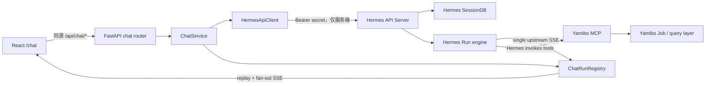

# Web Chat（Hermes Sessions + Runs）开发规格

> 版本：2.0.0
>
> 更新日期：2026-08-19
>
> 状态：已实现，已于 2026-08-19 通过本地、真实 Hermes API 与浏览器验收
>
> 目标读者：编码 LLM、代码审查 LLM、维护者

## 0. 如何使用本文

本文不是产品畅想，而是可直接执行的实现规格。编码 LLM 应按第 16 节顺序开发，并以第 18 节判断完成。

- **必须（MUST）**：缺失即不满足目标能力集。
- **应该（SHOULD）**：除非有代码证据证明不适用，否则实现。
- **不得（MUST NOT）**：违反会造成状态错乱、安全问题或架构回退。
- **可以（MAY）**：不影响本期验收的可选增强。

实现前必须阅读：

- `src/yamibo_mcp/services/web_chat.py`
- `src/yamibo_mcp/web_fastapi/routers/chat.py`
- `src/yamibo_mcp/web_fastapi/app.py`
- `c/src/pages/Chat.tsx`
- `c/src/api/client.ts`
- `c/src/styles/chat.css`
- `tests/unit/test_application/test_web_chat_sse.py`
- `tests/unit/test_application/test_web_chat_stream_turn.py`
- `tests/unit/test_web_fastapi/test_app.py`
- `docs/LLM原生运行时路线图.md`

## 1. 决策摘要

Web Chat 要实现接近 Hermes Dashboard Chat 页的体验，但仍然只是**外部 OpenAI-compatible/Hermes Agent 的转发入口**。

唯一链路：

```text
会话管理
  └─ Hermes /api/sessions

开始一轮对话
  └─ POST /v1/runs，携带 session_id 和 conversation_history

实时显示
  └─ GET /v1/runs/{run_id}/events

停止
  └─ POST /v1/runs/{run_id}/stop

审批
  └─ POST /v1/runs/{run_id}/approval

完成后校准
  ├─ GET /v1/runs/{run_id}
  └─ GET /api/sessions/{session_id}/messages
```

硬性决策：

1. Hermes SessionDB 是会话和消息的唯一事实来源。
2. Hermes Run 表示一次用户输入触发的 Agent 执行。
3. Yamibo 后端负责鉴权代理、协议归一化、单路 SSE 消费、浏览器扇出和结束校准。
4. 浏览器不得直接连接 Hermes，不得读取 Hermes API Key。
5. 不实现图片、文件、音频、视频或其他多模态输入。
6. 不恢复 Yamibo 内部 Agent Runtime；Hermes 仍是唯一 LLM Agent。
7. Hermes Run 与 Yamibo Job 是两套生命周期，不得合并。

## 2. 目标与非目标

### 2.1 本期目标

- 创建、列出、选择、重命名、删除 Hermes Session。
- 在已有 Session 上发起 Run，并完整延续历史上下文。
- 实时显示 assistant 文本、工具开始/结束、reasoning、审批请求和终态。
- 支持停止 Run，以及 `once`、`session`、`always`、`deny` 四种审批。
- 页面刷新或浏览器 SSE 重连后，尽可能恢复当前 Run。
- Run 完成、失败、取消或流中断后，用 Run 状态和 Session 消息校准。
- 区分“流式临时视图”和“Hermes 已持久化消息”。
- 桌面和窄屏均可完成核心操作。

### 2.2 非目标

- 不实现 Yamibo 内部 planner、tool loop、Agent Run 表或审批表。
- 不由 React 直接调用 Yamibo MCP 或业务 Job handler。
- 不从普通 assistant 文本推断工具调用、审批或 Job 状态。
- 不在对话页实现 RAG 编排。
- 不实现分享、多人协作、语音、附件、多模态。
- 不保证 Hermes API Server 重启后恢复内存 Run 事件。
- 不使用 Hermes `/api/sessions/{id}/chat` 或 `/chat/stream`；Run API 是唯一执行入口。
- 不自动迁移旧 `data/chat/sessions.json`。

## 3. 领域术语与边界

| 名称 | 唯一标识 | 所有者 | 生命周期 | 说明 |
| --- | --- | --- | --- | --- |
| Conversation / Session | `session_id` | Hermes SessionDB | 多轮、持久化 | 一个对话及其消息历史 |
| Run | `run_id` | Hermes API Server | 单轮、短期 | 一次用户输入触发的 Agent 执行 |
| Job | `job_id` | Yamibo DB + Daemon | 业务异步任务 | 归档、同步、导出等工作 |

规则：

- 前端类型必须使用 `ChatSession`、`ChatRun`、`JobSummary` 等不同名称。
- 不得把 `run_id` 写入 `job_id`，不得把 Run 状态映射成 Job 状态。
- Hermes 调用 Yamibo MCP 后创建的 Job 只作为工具结果展示；Job 状态仍由现有 Job API 查询。

## 4. 当前实现与目标差距

当前代码使用 `POST /v1/chat/completions`，将会话写入 `data/chat/sessions.json`；前端又写入 `localStorage` 并与服务端合并，形成多个事实来源。

| 当前行为 | 问题 | 目标行为 |
| --- | --- | --- |
| JSON 文件保存会话 | 与 Hermes SessionDB 分叉 | Hermes `/api/sessions` 为唯一来源 |
| 浏览器创建 `chat-*` ID | Session 未必存在 | 先创建 Hermes Session，再使用返回 ID |
| 前端上传 `history` | 缓存可过期或篡改 | 后端从 Hermes 读取历史 |
| 最近 8 条、每条 2000 字符 | 破坏工具链和长上下文 | 发送上游接受的完整文本历史 |
| 只显示 `delta/done` | 丢失工具、审批和终态 | 使用类型化事件 |
| 浏览器请求直接消费上游流 | Hermes SSE 是单消费队列 | 后端单消费者再扇出 |
| context 返回原始 API Key | 泄露凭据 | 只返回 `has_api_key` |
| localStorage 覆盖服务端 | 旧数据覆盖权威消息 | 只缓存 UI 偏好和选中 ID |

切换完成后删除旧 `/api/chat/turn`，不得长期保留两套执行路径。

## 5. 总体架构



责任分配：

- **React**：展示数据，维护草稿、滚动、展开等 UI 状态；不持有 Key、不构造历史、不决定最终结果。
- **Yamibo Web**：访问 Hermes、校验状态、读取历史、发起 Run、唯一消费 SSE、扇出和校准。
- **Hermes**：持久化 Session/消息，执行 Agent、工具循环和审批，产生 Run 状态与事件。

## 6. Hermes 上游协议

### 6.1 配置与鉴权

继续使用：

- `YAMIBO_HERMES_HOST`
- `YAMIBO_HERMES_PORT`
- `YAMIBO_HERMES_API_KEY`
- `YAMIBO_HERMES_MODEL`

默认端口为 `8642`。宿主机直接运行可用 `127.0.0.1`；容器内必须使用容器可访问地址。不得硬编码单一部署地址。

```http
Authorization: Bearer <server-side-secret>
Content-Type: application/json
```

日志、错误、测试快照、前端 payload 均不得出现真实 Key。

Web Chat 默认启用 Hermes SSE 流式显示。设置页的“启用流式对话显示”只控制前端是否展示已接收的 `message.delta`、工具事件和 `reasoning.available`；关闭时 Yamibo 仍必须在后台消费 SSE，以便可靠获得终态、停止结果和 Session 校准，不提供伪造的非流式 Hermes 执行路径。

### 6.2 能力检查

`ChatService` 初始化时依次检查：

1. `GET /health`
2. `GET /v1/capabilities`
3. `GET /v1/models`

最低能力：

- `run_submission`
- `run_status`
- `run_events_sse`
- `run_stop`
- `run_approval_response`
- `session_resources`

缺少能力时 `/api/chat/context` 返回 `ready: false`、`HERMES_CAPABILITY_MISSING`，发送框禁用。不得静默回退到 `/v1/chat/completions`。

能力缓存 30 秒；“测试连接”绕过缓存。

### 6.3 Session API

| Hermes API | 用途 | 约束 |
| --- | --- | --- |
| `GET /api/sessions?limit=&offset=&source=&include_children=` | 分页列表 | `limit` 最大 200 |
| `POST /api/sessions` | 新建 | 只传 `title`、`model`，ID 可由 Hermes 生成 |
| `GET /api/sessions/{session_id}` | 详情 | 404 映射稳定本地错误 |
| `PATCH /api/sessions/{session_id}` | 重命名/结束 | 只支持 `title`、`end_reason` |
| `DELETE /api/sessions/{session_id}` | 删除 | 有活动 Run 时本地返回 409 |
| `GET /api/sessions/{session_id}/messages` | 权威消息 | 打开会话和结束校准时读取 |

创建示例：

```json
{"title": "新对话", "model": "hermes-agent"}
```

消息可能包含 `role`、`content`、`tool_call_id`、`tool_calls`、`tool_name`、`reasoning`、`reasoning_content`、`finish_reason`、`timestamp`。前端显示模型必须保留这些字段，不得压扁成仅 `user | assistant`。

### 6.4 发起 Run

固定顺序：

1. 校验 Session 存在且无活动 Run。
2. `GET /api/sessions/{session_id}/messages`。
3. 按原顺序归一化为 `{role, content}` 历史。
4. `POST /v1/runs`。
5. 收到 HTTP 202 和 `run_id` 后注册 Run，并启动唯一上游 SSE 消费线程。
6. 将 `run_id` 返回浏览器。

```json
{
  "model": "hermes-agent",
  "session_id": "api_123_example",
  "input": "请继续分析上一轮的结果",
  "conversation_history": [
    {"role": "user", "content": "上一轮问题"},
    {"role": "assistant", "content": "上一轮回答"}
  ]
}
```

关键事实：`session_id` 只设置身份，`POST /v1/runs` **不会自动载入 SessionDB 历史**。因此 `conversation_history` 是必需字段，即使为空也显式发送。

历史规则：

- 保持顺序，不做“最近 N 条”截断。
- 接受非空 `role` 和文本化 `content`。
- 结构化 `content` 使用确定性 JSON 序列化，禁止丢弃 tool 消息。
- Run 当前只读取历史的 `role/content`；`tool_calls` 等扩展字段仅用于 UI。
- 当前用户输入只放在 `input`，不得重复追加到 history。
- 历史读取失败返回 `CHAT_HISTORY_UNAVAILABLE`，不得用空历史继续旧 Session。

### 6.5 查询、停止、审批

```text
GET  /v1/runs/{run_id}
POST /v1/runs/{run_id}/stop
POST /v1/runs/{run_id}/approval
```

```json
{"choice": "once", "resolve_all": false}
```

允许值只有 `once | session | always | deny`。停止返回 `stopping` 只表示请求受理；UI 必须等待终态，不能直接标记 `cancelled`。

## 7. Run 状态机

```text
preparing -> submitting -> queued -> running
                                -> waiting_for_approval -> running
                                -> stopping
queued | running | waiting_for_approval | stopping
                                -> reconciling
                                -> completed | failed | cancelled | unknown
```

补充规则：

- `preparing | submitting` 可直接到 `failed`。
- 每个 Session 同时最多一个非终态 Run；第二次发送返回 409、`CHAT_SESSION_BUSY`。若 Run 进入 `unknown`，在 Hermes 明确返回终态前仍占用该 Session，避免上游仍在执行时启动并行 Run。
- 不同 Session 可以并行。
- 非法状态转换记录 warning 并忽略，不得倒退 UI。
- `waiting_for_approval` 时发送框禁用，审批面板可操作。
- 终态 Run 在 Registry 保留 1 小时。

## 8. 上游 SSE 与本地扇出

### 8.1 单路消费原则

Hermes `/v1/runs/{run_id}/events` 使用进程内单队列；读取会消费事件，连接结束后 stream 可能被移除，且无 `Last-Event-ID` 重放。

- 浏览器不得直连 Hermes。
- 同一 `run_id` 不得建立两个上游 SSE 连接。
- 刷新、多个标签页、重连只能订阅 Yamibo 本地事件流。

### 8.2 `ChatRunRegistry`

在 `src/yamibo_mcp/services/chat_runtime.py` 新增 Registry。每个 Run 至少保存：

```python
run_id: str
session_id: str
status: ChatRunStatus
created_at: float
updated_at: float
last_seq: int
events: deque[NormalizedChatEvent]
subscribers: set[queue.Queue]
upstream_thread: threading.Thread | None
stop_requested: bool
terminal_payload: dict | None
error: dict | None
```

约束：

- ring buffer 最多 500 个事件且序列化总量不超过 1 MiB，超限删除最旧项。
- 每个事件分配严格递增 `seq`，Yamibo SSE 使用 `id: <seq>`。
- `Last-Event-ID` 重放更大的事件，再订阅新事件。
- ID 早于 buffer 最小序号时，先发 `stream.gap` 并触发校准。
- 订阅者断开只移除自己，不停止上游消费。
- 应用关闭时关闭本地连接，但不得自动向 Hermes 发送 stop。
- Registry 挂在 `app.state`，不得使用测试间共享的模块级可变单例。

### 8.3 事件映射

| 本地 `type` | Hermes `event` | 必需字段 |
| --- | --- | --- |
| `message.delta` | `message.delta` | `run_id`, `seq`, `delta`, `timestamp` |
| `tool.started` | `tool.started` | `tool`, `preview`, `timestamp` |
| `tool.completed` | `tool.completed` | `tool`, `duration`, `error`, `timestamp` |
| `reasoning.available` | `reasoning.available` | `text`, `timestamp` |
| `approval.request` | `approval.request` | `choices`, 安全命令摘要、`timestamp` |
| `approval.responded` | `approval.responded` | `choice`, `resolved`, `timestamp` |
| `run.completed` | `run.completed` | `output`, `usage`, `timestamp` |
| `run.failed` | `run.failed` | `error`, `timestamp` |
| `run.cancelled` | `run.cancelled` | `timestamp` |
| `stream.gap` | 本地 | `after_seq`, `available_from` |
| `stream.error` | 本地 | 稳定错误对象 |
| `session.reconciled` | 本地 | `session_id`, `message_count` |

未知上游事件不得使线程崩溃；转成 `stream.error`（`CHAT_UPSTREAM_EVENT_UNKNOWN`）并继续。

```text
id: 17
event: message.delta
data: {"type":"message.delta","run_id":"run_x","seq":17,"delta":"你好"}

```

每 15 秒发送 comment keepalive。响应头必须含 `Content-Type: text/event-stream`、`Cache-Control: no-cache`、`X-Accel-Buffering: no`。

## 9. 校准与故障恢复

### 9.1 正常终态

收到 `run.completed/failed/cancelled` 后进入 `reconciling`：

1. `GET /v1/runs/{run_id}` 获取最终状态、输出、usage 或 error。
2. `GET /api/sessions/{session_id}/messages` 获取权威消息。
3. 缓存校准结果并发 `session.reconciled`。
4. 设置最终本地状态。

assistant 最终内容以 Session messages 为准；`run.completed.output` 只作未持久化时的临时回退。

### 9.2 SSE 意外断开

没有终态而 SSE 结束时：

1. 进入 `reconciling`，不得立即显示失败。
2. 查询 Run，间隔 `0.25s, 0.5s, 1s, 2s, 4s`，总等待不超过 10 秒。
3. 得到终态则正常校准。
4. Run 仍在执行则标记 `unknown`、`CHAT_RUN_STREAM_LOST`，并读取 Session messages；在 Hermes 明确返回终态前，Session 继续视为忙碌，禁止启动第二个 Run。
5. UI 提示“实时连接已丢失，已校准当前消息”，不得自动重提输入。

### 9.3 服务重启

- 前端保存的 `run_id` 只用于一次恢复探测。
- 若 Hermes 还能查询 Run，返回状态并校准消息。
- 若 Hermes 返回 404，提示状态不可恢复，但仍加载 Session messages。
- 不自动创建替代 Run。

## 10. Yamibo 本地 API

错误统一为：

```json
{
  "error": {
    "code": "CHAT_SESSION_BUSY",
    "message": "该会话已有正在运行的请求",
    "retryable": false,
    "details": {}
  }
}
```

### 10.1 Context

`GET /api/chat/context`

```json
{
  "ready": true,
  "transport": "hermes_runs",
  "model": "hermes-agent",
  "hermes": {
    "endpoint": "http://127.0.0.1:8642",
    "connected": true,
    "version": "0.18.0",
    "has_api_key": true,
    "capabilities": ["run_submission", "run_events_sse", "session_resources"]
  }
}
```

不得返回 `api_key`、配置文件路径、Session 文件路径。

### 10.2 Sessions

```text
GET    /api/chat/sessions?limit=50&offset=0
POST   /api/chat/sessions
GET    /api/chat/sessions/{session_id}
PATCH  /api/chat/sessions/{session_id}
DELETE /api/chat/sessions/{session_id}
GET    /api/chat/sessions/{session_id}/messages
```

保留 Hermes 字段，只补充必要 UI 默认值，不重命名上游 ID。

### 10.3 Runs

```text
POST /api/chat/sessions/{session_id}/runs
GET  /api/chat/runs/{run_id}
GET  /api/chat/runs/{run_id}/events
POST /api/chat/runs/{run_id}/stop
POST /api/chat/runs/{run_id}/approval
```

浏览器发起 Run 只允许：

```json
{"input": "用户输入"}
```

浏览器不得提交 `history`、`model`、`instructions`、`session_id` 或 endpoint。
路由必须使用 Pydantic request model 并设置 `extra="forbid"`，不能继续接收无约束的 `dict` body。

成功响应 HTTP 202：

```json
{
  "run_id": "run_x",
  "session_id": "api_x",
  "status": "queued",
  "events_url": "/api/chat/runs/run_x/events"
}
```

### 10.4 状态映射

| 场景 | HTTP | 本地错误码 |
| --- | ---: | --- |
| 输入为空/审批非法 | 400 | `CHAT_INVALID_REQUEST` |
| Hermes Key 无效 | 502 | `HERMES_AUTH_FAILED` |
| Session 不存在 | 404 | `CHAT_SESSION_NOT_FOUND` |
| Run 不存在 | 404 | `CHAT_RUN_NOT_FOUND` |
| 同 Session 已有 Run | 409 | `CHAT_SESSION_BUSY` |
| 无待审批 | 409 | `CHAT_APPROVAL_NOT_PENDING` |
| 历史不可读取 | 502 | `CHAT_HISTORY_UNAVAILABLE` |
| Hermes 不可达 | 503 | `HERMES_UNAVAILABLE` |
| 能力不足 | 503 | `HERMES_CAPABILITY_MISSING` |
| SSE 丢失且无法恢复 | 502 | `CHAT_RUN_STREAM_LOST` |
| 上游协议错误 | 502 | `CHAT_UPSTREAM_PROTOCOL_ERROR` |

上游错误正文必须脱敏后再记录或返回。

## 11. 后端实现指定

### 11.1 文件划分

| 文件 | 职责 |
| --- | --- |
| `src/yamibo_mcp/services/hermes_api.py` | 同步 HTTP、JSON、SSE、上游 DTO 和错误映射 |
| `src/yamibo_mcp/services/chat_runtime.py` | 状态机、单消费者、ring buffer、扇出、校准 |
| `src/yamibo_mcp/services/web_chat.py` | ChatService 门面、Session 操作、历史归一化、能力检查 |
| `src/yamibo_mcp/web_fastapi/routers/chat.py` | 参数校验、HTTP 映射、SSE response；无上游协议细节 |
| `src/yamibo_mcp/web_fastapi/deps.py` | 从 `request.app.state` 取 ChatService |
| `src/yamibo_mcp/web_fastapi/app.py` | 创建/关闭 ChatService，绑定生命周期 |

不新增第三方依赖。客户端继续使用标准库 HTTP；阻塞 SSE 必须在后台线程，不能阻塞 FastAPI event loop。

### 11.2 `HermesApiClient` 最小接口

```python
class HermesApiClient:
    def health(self) -> dict: ...
    def capabilities(self) -> dict: ...
    def models(self) -> dict: ...
    def list_sessions(self, *, limit: int, offset: int) -> dict: ...
    def create_session(self, *, title: str, model: str) -> dict: ...
    def get_session(self, session_id: str) -> dict: ...
    def update_session(self, session_id: str, patch: dict) -> dict: ...
    def delete_session(self, session_id: str) -> dict: ...
    def get_messages(self, session_id: str) -> dict: ...
    def start_run(self, *, session_id: str, input_text: str, history: list[dict]) -> dict: ...
    def get_run(self, run_id: str) -> dict: ...
    def iter_run_events(self, run_id: str): ...
    def stop_run(self, run_id: str) -> dict: ...
    def approve_run(self, run_id: str, *, choice: str, resolve_all: bool) -> dict: ...
```

连接超时 5 秒，普通读取 30 秒。Run SSE 必须允许 30 秒 keepalive，不得把统一 180 秒当作 Run 总时限。

SSE parser 必须支持 CRLF/LF、多个 `data:`、comment、`event:`、`id:`、无尾部空行和无效 JSON。无效 JSON 生成协议错误事件，并完成资源清理。

### 11.3 生命周期与锁

- `create_app(settings)` 创建一个 `ChatService` 写入 `app.state.chat_service`。
- Registry 映射和 Session 活动 Run 索引用 `threading.RLock`。
- 锁内只改内存，不执行网络 I/O、不等待 Queue、不序列化大对象。
- 新建 Run 先放置 `preparing` 占位，防止并发双提交；失败必须释放。
- 上游线程所有退出路径都必须校准，或明确记录无法校准的原因。
- shutdown 只关闭本地订阅和连接，不隐式审批或停止 Hermes Run。
- 前端使用 `fetch()` 读取本地 GET SSE，以便在页面恢复时显式设置 `Last-Event-ID`；不要使用无法设置该 header 的裸 `EventSource` 恢复路径。

### 11.4 安全要求

- 删除 `get_chat_context()` 中 `hermes.api_key`。
- Chat 页面不得读取 `SettingsResponse.stored.hermes_api_key`；密码框加载时永远为空，只显示“已配置/未配置”。
- `Authorization`、Cookie、环境变量、命令中的凭据必须脱敏。
- 审批只显示 Hermes 已脱敏摘要，不重新拼成 shell 命令。
- 不记录完整 history；只记录数量、角色序列和字符数。

## 12. 前端实现指定

### 12.1 文件拆分

```text
c/src/pages/Chat.tsx
c/src/components/chat/ChatSessionList.tsx
c/src/components/chat/ChatTranscript.tsx
c/src/components/chat/ChatMessageView.tsx
c/src/components/chat/ChatToolEvent.tsx
c/src/components/chat/ChatReasoning.tsx
c/src/components/chat/ChatApprovalDialog.tsx
c/src/components/chat/ChatComposer.tsx
c/src/hooks/useChatSessions.ts
c/src/hooks/useChatRunStream.ts
c/src/types/chat.ts
c/src/styles/chat.css
```

- `Chat.tsx` 只编排页面，不解析 SSE。
- `useChatSessions` 负责分页、CRUD、刷新消息。
- `useChatRunStream` 负责发起、订阅/重连、按 `seq` 去重、校准。
- `ChatTranscript` 只渲染 view model。
- `ChatApprovalDialog` 明确四个选择，默认焦点不得放在 `always`。
- `ChatComposer` 负责发送、停止、快捷键和禁用状态。

项目无前端测试框架，本期不新增依赖。必须用 TypeScript build 和后端契约测试覆盖边界；状态转换写为无 React 依赖的纯函数。

### 12.2 类型

`c/src/types/chat.ts` 至少定义：

```ts
type ChatRole = 'system' | 'user' | 'assistant' | 'tool' | 'unknown'
type ChatRunStatus =
  | 'preparing' | 'submitting' | 'queued' | 'running'
  | 'waiting_for_approval' | 'stopping' | 'reconciling'
  | 'completed' | 'failed' | 'cancelled' | 'unknown'

type ChatEvent =
  | MessageDeltaEvent | ToolStartedEvent | ToolCompletedEvent
  | ReasoningAvailableEvent | ApprovalRequestEvent | ApprovalRespondedEvent
  | RunCompletedEvent | RunFailedEvent | RunCancelledEvent
  | StreamGapEvent | StreamErrorEvent | SessionReconciledEvent
```

禁止用大量可选字段的单一 `ChatStreamEvent` 替代判别联合类型。

### 12.3 页面行为

**会话栏**

- 首屏最近 50 个，滚动到底用 `offset` 加载。
- 标题、preview、message_count、last_active 来自 Hermes。
- 新建成功前不得插入伪 Session。
- 删除需确认；有活动 Run 时禁止删除。
- 重命名 Enter/失焦提交，Escape 取消。

**消息区**

- 打开 Session 立即请求权威消息。
- 历史消息与当前 Run 临时事件分层；不得把每个 delta 写成一条消息。
- assistant delta 累加到一个临时 block。
- tool started/completed 按轮次分组；没有 tool call ID 时按接收顺序配对并标记局限。
- 流式思考期间 reasoning 默认展开并限制高度；内容超出后在面板内滚动，始终跟随最新事件。
- 最终 assistant 文本第一次出现时立即收起 reasoning；历史 reasoning 默认折叠，无事件不显示空区域。
- 连续列表和表格必须保留列/列表结构，在窄屏消息气泡内换行，不得把长 skill 名称或空表格单元格撑出消息区。
- 同一用户段内出现多个非空 `finish_reason=stop` assistant 块时，界面只展示最新终态块；不得跨用户消息去重，也不得修改 Hermes 权威消息。
- 校准后用 Session messages 整体替换临时消息；工具时间线可保留到刷新。

**滚动**

- 位于底部 80px 内时自动跟随。
- 用户向上滚动后停止跟随，不显示额外的“回到底部”气泡按钮。
- 切换 Session 时直接显示最新消息，不播放跳转到末尾的动画。

**输入**

- Enter 发送，Shift+Enter 换行；输入法 composition 时不发送。
- 空输入、无 Session、服务未 ready、Session 有活动 Run 时禁用。
- 保留可恢复草稿，直到 HTTP 202；失败则恢复输入。
- 不自动重试；用户重试前先校准消息，再用原文创建新 Run。

**停止与审批**

- Run 活动时发送按钮变为停止。
- 停止后进入 `stopping`，等待真实终态。
- 审批必须用户显式选择，禁止自动批准。
- `always` 使用危险样式和二次确认；`deny` 不等于停止 Run。

### 12.4 本地存储

允许保存：选中的 `session_id`、按 Session 分区的草稿、UI 展开偏好、最后 `run_id/seq`（仅恢复探测）。

不得保存：消息事实副本、Hermes Key、完整 settings payload、完整 Run 事件历史。

旧键 `yamibo.chat.sessions.v2`、`yamibo.chat.context.v2`、`yamibo.chat.settings.v2` 停止读取；无需主动删除。

## 13. 旧数据切换

- `data/chat/sessions.json` 变为只读遗留文件，不再读写，也不删除。
- 不自动导入 Hermes；未来若迁移，另写带 dry-run 的显式 CLI。
- 删除旧 chat completions、JSON 文件读写和最近 N 条历史逻辑。
- 删除旧 `/api/chat/turn` 及前端 client 方法。
- 经 `rg` 确认无其他消费者后，删除仅服务旧链路的 `chat_transport`、`chat_mcp_sse_url`、`hermes_stream` 及对应环境变量/测试 fixture；Run 链路始终流式，不保留开关。

## 14. 可观测性

每个 Run 结构化记录：`event`、`run_id`、`session_id`、`status`、`upstream_status`、`event_type`、`duration_ms`、`subscriber_count`、`history_message_count`、`error_code`。

不得记录用户/assistant 全文、API Key、Authorization 或审批命令原文。

建议事件：`chat.run.submitted`、`chat.run.upstream_connected`、`chat.run.event_received`、`chat.run.stream_disconnected`、`chat.run.reconciled`、`chat.run.terminal`、`chat.session.operation_failed`。

## 15. 测试方案

### 15.1 文件

```text
tests/unit/test_application/test_hermes_api.py
tests/unit/test_application/test_chat_runtime.py
tests/unit/test_application/test_web_chat.py
tests/unit/test_web_fastapi/test_chat_routes.py
```

旧 `test_web_chat_sse.py` 和 `test_web_chat_stream_turn.py` 应重写或删除旧断言，不得继续把 chat completions 和 JSON Session 当成正确行为。

### 15.2 必测用例

**HermesApiClient**

- 请求带 Bearer，但测试输出不泄露 Key。
- 201/202/204、4xx、5xx、连接失败、超时映射。
- SSE 的 LF、CRLF、多 data、comment、keepalive、尾事件、无效 JSON。
- Session 分页和 URL 编码。

**历史**

- 有 `session_id` 时仍发送显式 history。
- 保持 system/user/assistant/tool 顺序。
- 当前输入不重复。
- 结构化 content 确定性序列化。
- 历史失败不会提交空上下文 Run。

**Registry**

- 同 Run 只有一个上游消费者。
- 两订阅者收到相同 seq 和顺序。
- 一个断开不影响另一个和上游。
- `Last-Event-ID` 重放与 `stream.gap`。
- ring buffer 条数/字节上限。
- 同 Session busy，不同 Session 可并发。
- 所有终态触发双校准。
- 无终态断流走轮询恢复。
- stop 不提前产生 cancelled。
- approval 非 waiting 状态返回冲突。

**FastAPI**

- context 不含 API Key。
- 浏览器不能提交 history/model/instructions。
- Session CRUD 与上游状态映射。
- Run 返回 202，SSE 含 `id/event/data` 与禁缓冲头。
- 所有 Chat 错误结构一致。

### 15.3 验证命令

```bash
uv run pytest tests/unit/test_application/test_hermes_api.py \
  tests/unit/test_application/test_chat_runtime.py \
  tests/unit/test_application/test_web_chat.py \
  tests/unit/test_web_fastapi/test_chat_routes.py

uv run pytest tests/unit/test_web_fastapi/ tests/unit/test_application/

cd c && npm run build

uv run pytest tests/unit/
```

若全量测试受外部 PostgreSQL、浏览器或账号条件限制，交付报告必须列出未运行项和原因。

## 16. 实施阶段

### Phase 1：上游客户端和契约测试

1. 新建 `hermes_api.py` 和错误类型。
2. 实现探测、Session CRUD、Run 操作和 SSE parser。
3. 用本地 fake HTTP server 测试，不访问真实 Hermes。
4. 通过 `test_hermes_api.py` 再进入下一阶段。

完成定义：测试精确证明方法、路径、body、鉴权和事件解析。

### Phase 2：Run Registry 和校准

1. 新建 `chat_runtime.py`。
2. 实现状态机、Session 排他、单消费者、buffer、扇出和重放。
3. 实现终态及断流校准。
4. 测试线程退出、订阅断开和 shutdown。

完成定义：并发测试证明同 Run 仅一个上游 SSE，双订阅不会分走事件。

### Phase 3：ChatService 与 FastAPI

1. 重构 `web_chat.py` 为门面。
2. 在 `app.state` 初始化服务并提供依赖。
3. 替换 `chat.py` 为第 10 节接口。
4. Hermes 连接测试改为 capability probe。
5. 移除 API Key 暴露和旧 `/chat/turn`。

完成定义：路由契约通过，任何 JSON 都不含真实 Key。

### Phase 4：前端

1. 建立判别联合类型。
2. 替换旧 Chat API client。
3. 先实现 hooks，再拆 UI。
4. 完成停止、审批、重连、滚动和校准。
5. 停止读取旧 localStorage 会话缓存。

完成定义：`npm run build` 通过，浏览器可完成 CRUD 和一轮带工具事件的 Run。

### Phase 5：清理、回归、真实验收

1. 删除旧 chat completions、JSON Session 和无用类型/样式。
2. 运行第 15.3 节。
3. 使用已启动 Hermes 做一次受控真实验收。
4. 检查日志和浏览器响应无 secret。
5. 本文状态改为“已实现”时，记录验收日期和实际命令结果。

## 17. 编码 LLM 执行规则

1. 一次只实现一个 Phase，不同时重写前后端。
2. 修改前阅读目标文件和相邻测试，不凭本文猜函数签名。
3. 先写/更新该 Phase 的失败测试，再改实现。
4. 优先删除旧路径和复用工具，不新增依赖或平行抽象。
5. 每个 Phase 后运行最小测试；失败则留在当前 Phase。
6. 不修改 Chat 以外的脏工作树文件，不做全仓格式化。
7. 不把真实 Key 写入源码、测试、文档、命令或提交。
8. 前端修改后必须执行 `cd c && npm run build`。
9. 编译通过与真实服务验收分别报告。
10. 不提交或推送，除非任务明确要求。

若 Hermes 实际响应与本文不一致：保存最小脱敏证据，阅读当前 Hermes API 实现或 capability，更新契约测试和本文；不得用宽松 `dict.get()` 链静默吞掉变化。

## 18. 最终验收条件

- [x] context 验证 Hermes 能力且不返回 API Key。
- [x] Session CRUD 全由 Hermes `/api/sessions` 驱动。
- [x] 发 Run 前读取消息并显式发送 `conversation_history`。
- [x] 同 Session 不并发两个 Run。
- [x] 同 Run 永远只有一个 Hermes SSE 消费者。
- [x] 文本、工具、reasoning、审批和所有终态均类型化显示。
- [x] 浏览器重连可重放本地事件，缺口会提示并校准。
- [x] stop 不在确认前伪造 cancelled。
- [x] approval 只由用户显式操作，`always` 二次确认。
- [x] Run 结束后双校准 Run 状态和 Session messages。
- [x] 不读写 JSON Session，不以 localStorage 覆盖 Hermes。
- [x] 旧 `/api/chat/turn` 和 Chat 的 `/v1/chat/completions` 路径已删除。
- [x] 不存在多模态入口或附件占位控件。
- [x] 目标单测、Web API 回归和 `npm run build` 通过。
- [x] 真实 Hermes 完成：新建 Session → 发 Run → 看流 → 至少一次 stop 或 approval → 最终校准。
- [x] 浏览器响应、日志、测试输出、Git diff 无真实 Hermes Key。

### 18.1 2026-08-18 实现与验收记录

- `uv run pytest tests/unit/`：`1188 passed`。
- `cd c && npm run build`：TypeScript 和 Vite 构建通过，`99 modules transformed`。
- 真实 Hermes 0.18.0：capability probe 通过；Session CRUD、Run SSE、stop 和终态校准通过。真实 SSE 的事件名位于 JSON `event` 字段，上游未发终态时由本地查询并合成终态。
- 真实 Session API envelope 已固化契约：列表为 `object=list,data=[]`，单 Session 为 `object=hermes.session,session={}`，消息为 `object=list,session_id,data=[]`。
- 浏览器：完成 Session 列表/新建、权威消息加载、发 Run、Stop 与刷新恢复；测试 Session 已删除。
- `git diff --check` 通过；真实 Hermes Key 未出现在响应、事件、日志、测试输出或仓库改动中。

### 18.2 2026-08-19 增量修复与验收记录

- 修复同一 Session 的 `unknown` Run 释放过早导致的并行提交风险，并增加回归测试；定向 Chat/Run/FastAPI 测试为 `42 passed`。
- 修复最终回复出现后 reasoning 仍保持展开、连续终态消息重复显示和 Markdown 列表窄屏溢出；`cd c && npm run build` 通过。
- 使用真实本地页面加载已有 skill 列表和重复结果会话，确认列表项不横向溢出、最终文本首次出现时 reasoning 已收起；临时验收 Session 已删除。

## 19. 已知限制

- Hermes 不向 Run SSE 转发 `_thinking` 和 `subagent_progress`，前端不得伪造。
- Hermes Run stream/status 位于内存，进程重启后可能无法恢复。
- Hermes Run SSE 无上游重放；Yamibo 只能重放已接收事件。
- Run payload 只消费历史的 `role/content`，完整 tool metadata 仅从 Session messages 展示。
- 工具产生的 Yamibo Job 可能在 Run 结束后继续；Chat Run 完成不等于 Job 完成。

## 20. 与 LLM 原生路线图的关系

本功能使用的是**外部 Hermes Run**，不是恢复 Yamibo 内部 Agent Runtime。Yamibo 仍只提供 Web 转发、MCP、Job/Daemon 和业务数据；Hermes 负责规划、工具选择、审批和 Agent 生命周期。

对话中出现 Yamibo Job 时继续遵守 [LLM 原生运行时路线图](LLM原生运行时路线图.md)：创建 Job 不代表完成，Hermes 应使用现有 Job 状态能力复查；Web Chat 不复制 Job 调度器。
